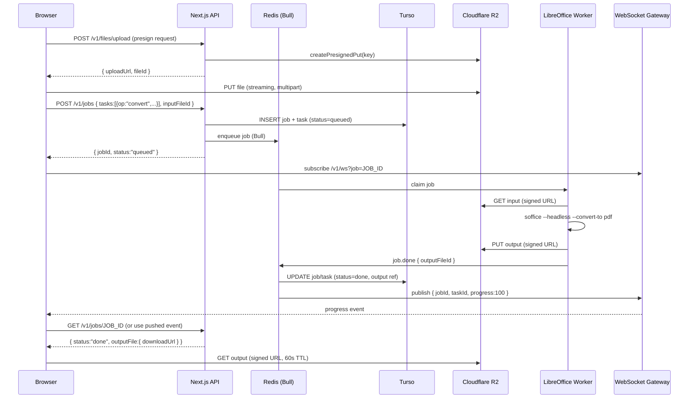
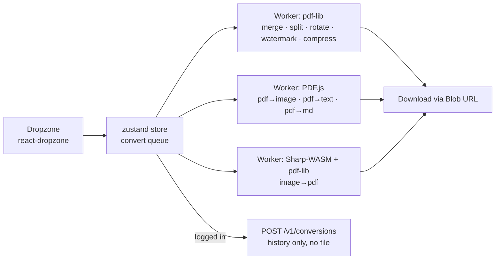
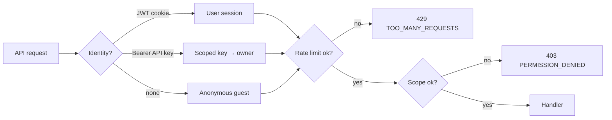

# Folio — System Architecture

> **Product:** Folio — *"Document conversion with style and substance."*
> A production-grade, browser-first document conversion platform supporting 20+ conversions between Word, PDF, PowerPoint, Excel, images, HTML, Markdown, and text — plus PDF utilities (merge, split, rotate, watermark, compress), batch conversion, OCR, cloud-storage imports, and a developer API.
>
> **Design reference:** This document is part of the Folio documentation set. All UI-facing decisions reference [`design.md`](../design.md) (premium, editorial, restrained black/white/red palette, Inter typography, sharp architectural shapes, generous whitespace).

---

## 1. Architectural Overview

Folio uses a **hybrid processing architecture**: simple PDF operations run **client-side in Web Workers** (private by default — files never leave the device), while office-format conversions (Word/PPT/Excel ↔ PDF) run **server-side on a LibreOffice worker fleet**. A **jobs/tasks model** (inspired by CloudConvert) decouples the API from processing, giving us durability, retryability, and observability.

```mermaid
flowchart TB
    subgraph Client["Browser (Next.js 14 App Router)"]
        UI[Folio Web App<br/>Tailwind · Zustand · React Query]
        WW[Web Workers<br/>pdf-lib · PDF.js · Sharp(wasm) · Tesseract.js]
        PWA[PWA Shell<br/>offline convert queue]
    end

    subgraph Edge["Cloudflare CDN"]
        CF[CDN · caching · DDoS protection]
    end

    subgraph App["Vercel (Next.js)"]
        API[API Routes /api/v1/*]
        WS[WebSocket Gateway<br/>job progress]
        AUTH[NextAuth.js<br/>OAuth · JWT]
    end

    subgraph Data["Data Layer"]
        REDIS[(Redis<br/>Bull queues · rate limits · cache)]
        TURSO[(Turso<br/>SQLite via libSQL · Prisma)]
        R2[(Cloudflare R2<br/>object storage · presigned URLs)]
    end

    subgraph Workers["Worker Fleet (Docker)"]
        LO[LibreOffice headless<br/>worker]
        PUPP[Puppeteer worker<br/>HTML → PDF]
        OCR[Tesseract worker<br/>OCR]
        IMG[Sharp worker<br/>image ops]
    end

    UI -->|uploads / jobs| API
    UI -->|progress stream| WS
    UI -->|client-side ops| WW
    UI --> PWA
    CF --> UI
    API --> AUTH
    API --> TURSO
    API --> REDIS
    API --> R2
    REDIS -->|enqueue job| LO
    REDIS -->|enqueue job| PUPP
    REDIS -->|enqueue job| OCR
    REDIS -->|enqueue job| IMG
    LO --> R2
    PUPP --> R2
    OCR --> R2
    IMG --> R2
    LO -->|progress| REDIS
    WS --> REDIS
```

### 1.1 Component Overview

| Component | Responsibility | Scaling unit |
|---|---|---|
| **Web app** (Next.js) | Landing page, convert UI, dropzone, history, settings; follows `design.md` | Vercel auto-scale |
| **API routes** | REST API (`/api/v1/*`), auth, rate limiting, job orchestration | Vercel serverless functions |
| **WebSocket gateway** | Streams job/task progress to the browser | Horizontal pods behind Redis pub/sub |
| **Web Workers** | Client-side PDF ops (merge, split, rotate, watermark, compress, image→PDF, PDF→image, PDF→text) | Per-device (zero server cost) |
| **Worker fleet** | LibreOffice (office conversions), Puppeteer (HTML→PDF), Tesseract (OCR), Sharp (images) | Docker containers, queue-backed |
| **Redis** | Bull job queues, rate-limit counters, hot cache, pub/sub for WS fan-out | Upstash / managed |
| **Turso (SQLite)** | Users, jobs, tasks, files, conversions history, usage, webhooks | Turso multi-tenant (schema-per-tenant at scale) |
| **Cloudflare R2** | Object storage for uploads/outputs; presigned upload/download URLs; S3-compatible | Infinite, pay-per-GB |

### 1.2 Key Design Decisions

1. **Client-first processing.** Merge, split, rotate, watermark, compress, image→PDF, PDF→image, PDF→text run entirely in the browser (pdf-lib + PDF.js + Sharp-WASM). This is the *privacy story* ("your files never leave your device"), reduces server load, and matches the strongest competitor patterns (Smallpdf, iLovePDF, and client-side converters like PDFSlice).
2. **Server-side only for office formats.** Word/PPT/Excel → PDF and reverse require a real office engine. We run **LibreOffice headless** in isolated Docker workers (`soffice --headless --convert-to`), the same engine used by CloudConvert's `office`/`libreoffice` engines.
3. **Jobs & tasks, not one-shot endpoints.** A job is a directed acyclic graph (DAG) of tasks (e.g., `import → convert → optimize → export`). This enables chained workflows (PDF → Word **and** thumbnail in one call), batch conversion, retries, and transparent pricing.
4. **Everything is queue-backed.** API routes only persist intent and enqueue work. Workers never talk to the API directly — they publish results to Redis and R2.
5. **Stateless API, stateful queues.** API pods can be killed at any time; jobs survive in Redis/Bull. Job state is persisted to Turso for the history feature.
6. **Presigned URLs everywhere.** Files are never proxied through the API. Uploads go straight to R2 via presigned PUT; downloads via presigned GET. This keeps serverless bandwidth costs near zero and bounds cold-start latency.

---

## 2. Conversion Catalog

Every supported conversion is declared in a **static catalog** (`lib/conversions.ts`), which drives the UI, validation, and docs. Nothing is hard-coded per-endpoint.

```ts
// lib/conversions.ts (abridged)
export type Engine = "libreoffice" | "pdf-lib" | "pdfjs" | "sharp" | "tesseract" | "puppeteer" | "mammoth" | "client";

export interface ConversionDef {
  id: string;            // "docx-pdf"
  from: string[];        // ["docx", "doc"]
  to: string;            // "pdf"
  engine: Engine;        // "libreoffice"
  location: "client" | "server";
  maxPages?: number;     // server-side safety cap
  maxSizeMB: number;     // per-plan limits applied on top
  options?: Record<string, unknown>; // engine defaults
  priceCredits: number;  // 1 credit per conversion
}

export const CONVERSIONS: ConversionDef[] = [
  // Primary conversions (TODO.md §Core Functionality)
  { id: "docx-pdf",   from: ["docx","doc"], to: "pdf",  engine: "libreoffice", location: "server", maxPages: 1000, maxSizeMB: 100, priceCredits: 1 },
  { id: "pdf-docx",   from: ["pdf"],        to: "docx", engine: "libreoffice", location: "server", maxPages: 500,  maxSizeMB: 100, priceCredits: 2 }, // OCR optional
  { id: "docx-pptx",  from: ["docx","doc"], to: "pptx", engine: "libreoffice", location: "server", maxPages: 1000, maxSizeMB: 100, priceCredits: 2 },
  { id: "pptx-pdf",   from: ["pptx","ppt"], to: "pdf",  engine: "libreoffice", location: "server", maxPages: 1000, maxSizeMB: 100, priceCredits: 1 },
  { id: "xlsx-pdf",   from: ["xlsx","xls","csv"], to: "pdf", engine: "libreoffice", location: "server", maxPages: 1000, maxSizeMB: 100, priceCredits: 1 },
  { id: "pdf-xlsx",   from: ["pdf"],        to: "xlsx", engine: "libreoffice", location: "server", maxPages: 500,  maxSizeMB: 100, priceCredits: 2 },
  { id: "image-pdf",  from: ["png","jpg","jpeg","webp","heic","tiff","gif","bmp"], to: "pdf", engine: "client", location: "client", maxSizeMB: 50, priceCredits: 1 },
  { id: "pdf-image",  from: ["pdf"], to: "png", engine: "pdfjs", location: "client", maxPages: 100, maxSizeMB: 50, priceCredits: 1 },
  { id: "html-pdf",   from: ["html","htm"], to: "pdf", engine: "puppeteer", location: "server", maxPages: 500, maxSizeMB: 25, priceCredits: 1 },
  { id: "txt-pdf",    from: ["txt","md","csv"], to: "pdf", engine: "libreoffice", location: "server", maxPages: 1000, maxSizeMB: 10, priceCredits: 1 },
  { id: "pdf-txt",    from: ["pdf"], to: "txt", engine: "pdfjs", location: "client", maxPages: 500, maxSizeMB: 50, priceCredits: 1 },
  { id: "md-pdf",     from: ["md"], to: "pdf", engine: "puppeteer", location: "server", maxPages: 500, maxSizeMB: 10, priceCredits: 1 },
  { id: "pdf-md",     from: ["pdf"], to: "md", engine: "pdfjs", location: "client", maxPages: 300, maxSizeMB: 50, priceCredits: 1 },
  { id: "pdf-pptx",   from: ["pdf"], to: "pptx", engine: "libreoffice", location: "server", maxPages: 300, maxSizeMB: 100, priceCredits: 3 },
  { id: "pptx-docx",  from: ["pptx","ppt"], to: "docx", engine: "libreoffice", location: "server", maxPages: 1000, maxSizeMB: 100, priceCredits: 2 },
  { id: "docx-xlsx",  from: ["docx","doc"], to: "xlsx", engine: "libreoffice", location: "server", maxPages: 1000, maxSizeMB: 100, priceCredits: 2 },
  // PDF utilities
  { id: "pdf-compress", from: ["pdf"], to: "pdf", engine: "pdf-lib", location: "client", maxPages: 1000, maxSizeMB: 100, priceCredits: 1 },
  { id: "pdf-merge",  from: ["pdf"], to: "pdf", engine: "pdf-lib", location: "client", maxPages: 1000, maxSizeMB: 200, priceCredits: 1, options: { multi: true } },
  { id: "pdf-split",  from: ["pdf"], to: "pdf", engine: "pdf-lib", location: "client", maxPages: 1000, maxSizeMB: 100, priceCredits: 1, options: { multiOutput: true } },
  { id: "pdf-rotate", from: ["pdf"], to: "pdf", engine: "pdf-lib", location: "client", maxPages: 1000, maxSizeMB: 100, priceCredits: 1 },
  { id: "pdf-watermark", from: ["pdf"], to: "pdf", engine: "pdf-lib", location: "client", maxPages: 1000, maxSizeMB: 100, priceCredits: 1 },
  // Suggested additions (beyond TODO.md core list)
  { id: "epub-pdf",   from: ["epub"], to: "pdf", engine: "libreoffice", location: "server", maxPages: 1000, maxSizeMB: 50, priceCredits: 1 },
  { id: "pdf-epub",   from: ["pdf"], to: "epub", engine: "libreoffice", location: "server", maxPages: 500, maxSizeMB: 100, priceCredits: 2 },
  { id: "docx-html",  from: ["docx","doc"], to: "html", engine: "mammoth", location: "server", maxPages: 1000, maxSizeMB: 50, priceCredits: 1 },
  { id: "pdf-html",   from: ["pdf"], to: "html", engine: "pdfjs", location: "client", maxPages: 300, maxSizeMB: 50, priceCredits: 1 },
  { id: "csv-xlsx",   from: ["csv"], to: "xlsx", engine: "libreoffice", location: "server", maxPages: 1000, maxSizeMB: 25, priceCredits: 1 },
  { id: "rtf-pdf",    from: ["rtf"], to: "pdf", engine: "libreoffice", location: "server", maxPages: 1000, maxSizeMB: 25, priceCredits: 1 },
  { id: "ocr-pdf",    from: ["pdf"], to: "pdf", engine: "tesseract", location: "server", maxPages: 100, maxSizeMB: 100, priceCredits: 3, options: { searchable: true } },
];
```

**Catalog rules:**
- One source of truth → served at `GET /api/v1/formats` and consumed by the dropzone UI, validation middleware, and the docs in this repository.
- `location: "client"` conversions never touch the server; the API only records history for logged-in users.
- `maxPages` is an engine-level DoS guard; per-plan `maxSizeMB` caps are layered on top.

---

## 3. Request Lifecycle (Server-Side Conversion)

The canonical flow for a server conversion, e.g. **Word → PDF**:



### 3.1 Upload flow

Uploads use **presigned PUT URLs** (S3/R2 native) — the API never buffers file bytes:

1. `POST /api/v1/files/upload` → validates format, size, plan quota → returns `{ uploadUrl, fileId, expiresAt }`.
2. Client streams the file with `fetch(uploadUrl, { method: "PUT", body: file })`, supporting multipart/streaming for large files.
3. An R2 **event notification** (or a post-upload check from the client) marks the file `ready`. The job endpoint rejects files that are not `ready`.
4. Files are **immutable**: the key is a random UUID with no user-controlled path components (`files/<uuid>/<uuid>.docx`), preventing path traversal and overwrites.

### 3.2 Job execution

- API route `POST /api/v1/jobs` validates tasks against the catalog, persists the job+task rows in a single transaction, then enqueues the Bull job.
- **Bull worker** claims the job; for LibreOffice conversions it runs in a container with a **fresh isolated profile** (`-env:UserInstallation=file:///tmp/lo_<jobId>`), which prevents profile-lock contention between concurrent conversions (a classic `soffice` failure mode).
- Progress is reported by the worker (page counts for PDFs, elapsed time otherwise) via Redis `publish`; the WS gateway fans out to subscribers. Heartbeat timeouts (default 5 min) cause the job to be retried on another worker.
- **Concurrency guard:** each worker container runs 1 conversion at a time; autoscaling is driven by Bull queue depth.

### 3.3 Output & retention

- Outputs are written to R2 under `files/<uuid>/<uuid>.<ext>` and referenced by `File` rows.
- **Retention:** anonymous jobs → 1 hour; free users → 24 h; paid users → 7 days. A scheduled sweeper deletes expired objects and rows (see `documentation/security.md` §Data Retention).
- Downloads are always via short-lived presigned URLs (60 s default, configurable), never public objects.

---

## 4. Client-Side (Web Worker) Pipeline

Client conversions never leave the device:



- Workers are created lazily per operation type and pooled (`navigator.hardwareConcurrency` cap of 2–4 to protect the main thread).
- Large files are processed page-by-page with `transferable` ArrayBuffers to avoid copying; progress is posted as `{ task, percent }` messages.
- **Offline support (PWA):** the queue is persisted in IndexedDB; pending client conversions can run while offline and complete when the service worker is ready (files are local, so only history sync needs connectivity).
- Browser support check (`feature-detect.ts`) degrades client conversions to server-side when Web Workers/`OffscreenCanvas` are unavailable.

---

## 5. Service Interactions

| Interaction | Protocol | Notes |
|---|---|---|
| Browser ↔ API | HTTPS REST (`/api/v1/*`) | JSON; Bearer JWT or API key |
| Browser ↔ R2 | HTTPS presigned PUT/GET | Direct, no proxy |
| Browser ↔ WS gateway | WSS | `?token=` JWT, channel = jobId |
| API ↔ Redis | RESP | Bull queues (`folio:jobs:*`), rate limits, cache, pub/sub |
| API ↔ Turso | libSQL wire (TLS) | Prisma ORM, WAL mode |
| Worker ↔ Redis | RESP | Claim jobs, publish progress/result |
| Worker ↔ R2 | S3 API (signed) | Input fetch, output put |
| API ↔ Email (Resend) | REST | Magic links, receipts, alerts |

**Idempotency:** all mutating endpoints accept an `Idempotency-Key` header; duplicate keys within 24 h return the original resource without re-executing (prevents double-charging on retries).

---

## 6. Real-Time Progress (WebSocket)

- Gateway URL: `wss://api.folio.app/v1/ws?token=<jwt>`.
- Client subscribes with `{ "type": "subscribe", "jobId": "..." }`.
- Events (all JSON, `{ type, jobId, taskId, ... }`):

| Event | Payload | Meaning |
|---|---|---|
| `task.progress` | `{ percent, stage? }` | 0–100 for a task |
| `task.finished` | `{ outputFileId }` | One task completed |
| `job.finished` | `{ downloadUrl, sizeBytes }` | All tasks done |
| `job.error` | `{ code, message }` | Terminal failure |
| `job.cancelled` | `{}` | Cancelled by user/API |

- **Fallback:** browsers without WS support poll `GET /api/v1/jobs/:id` at 2 s intervals (the UI chooses automatically).
- **Horizontal scaling:** gateway instances are stateless; events fan out via Redis pub/sub. Connection state lives in Redis so any gateway can resume a stream.
- **Auth:** the JWT is validated at handshake; the user may only subscribe to their own jobs (or jobs created with their API key).

---

## 7. Authentication & Authorization Flow

1. **Users:** NextAuth.js with Google/GitHub OAuth + email magic links. Sessions are JWT (stateless, signed with `NEXTAUTH_SECRET`) stored in an httpOnly cookie.
2. **API keys:** scoped keys (`jobs:read`, `jobs:write`, `files:read`, `webhooks:write`, …) hashed with SHA-256 at rest; sent as `Authorization: Bearer folio_live_...`.
3. **Middleware:** every `/api/v1/*` route runs a shared guard: resolve identity (JWT cookie → API key → anonymous), enforce rate limits, then authorize by scope.
4. **Anonymous users** get a guest session (short-lived JWT, `sub:anon:<fingerprint>`); their history is stored with `user_id = NULL` and purged with the file retention window.



---

## 8. Observability

- **Tracing:** OpenTelemetry (OTLP) with `traceparent` propagated from browser → API → Bull job → worker. Every job carries `jobId` as its trace root.
- **Metrics (Prometheus):** queue depth, job duration p50/p95/p99, worker saturation, conversion success rate, bytes processed, rate-limit hits. Dashboards in Grafana.
- **Logs:** structured JSON (`{ ts, level, jobId, taskId, engine, status, durationMs }`) shipped to Loki/CloudWatch. PII (filenames with sensitive terms, IPs) is redacted at the edge.
- **Errors:** Sentry with source maps; worker errors are tagged with engine + LibreOffice version. Alert rules:
  - queue depth > 500 for 5 min → scale workers / page on-call
  - conversion success rate < 98% for 10 min → page
  - p95 job duration > 60 s for 15 min → investigate engine regression
- **SLOs:** 99.9% API availability, p95 job enqueue → done < 45 s for office conversions, < 10 s for client conversions (device-bound), conversion success rate ≥ 99%.

---

## 9. Scalability Considerations

| Bottleneck | Strategy |
|---|---|
| LibreOffice CPU | Workers are the only CPU-bound tier; scale horizontally via queue depth (KEDA-style). Each container = 1 conversion. |
| Redis | Upstash-managed; queues sharded by job type (`office`, `html`, `ocr`). Rate-limit counters use hash slots, not SCAN. |
| Turso | Multi-region replicas for reads; primary per region (EU/US/APAC). At >1M jobs/mo, shard by `user_id` hash. |
| R2 bandwidth | Zero-egress from Cloudflare; presigned URLs keep traffic off serverless functions. |
| Serverless cold starts | API routes are I/O-only (never spawn LibreOffice inline); keep bundle small; regional placement `us-east-1` (closest to Turso/R2 defaults). |
| WS fan-out | Redis pub/sub; gateways scale independently of API functions. |
| Batch conversion | Batch jobs fan out to one task per file; per-file progress; total cap (e.g., 50 files / 2 GB) per batch. |

**Capacity target:** 1M conversions/month at launch-scale (see `plan/scalability-plan.md` for the full model and `documentation/performance.md` for benchmarks).

---

## 10. Competitive Research & Best Practices Adopted

Before writing this documentation set, we studied the leading conversion platforms and codified their lessons (source: platform docs, engineering write-ups, and API references, Aug 2026):

| Platform | Lesson adopted | Where it lands |
|---|---|---|
| **Smallpdf** | Client-side processing for PDF utilities (privacy + zero server cost); minimal, conversion-focused UI | Client-engine tier (`architecture.md` §4); `user-guide.md` §1 |
| **ILovePDF** | Short retention + encryption as the trust story; per-plan size/concurrency limits | `security.md` §7; `user-guide.md` §4 |
| **CloudConvert** | Jobs/tasks DAG model, scoped API keys, regional endpoints, `X-RateLimit-*` + `Retry-After`, structured error codes, webhook HMAC | `api-documentation.md` (entire); `database-schema.md` §3 (Job/Task) |
| **Zamzar** | Simple, reliable multi-format pipeline; clear queue semantics and timeouts | Engine timeouts + retry policy (`architecture.md` §3.2, `api-documentation.md` §2) |
| **Adobe Acrobat Online** | Enterprise security posture (SSO, audit, residency) as a later phase | `plan/implementation-roadmap.md` §4 (Phase 3) |

Additional engineering research (LibreOffice headless service patterns, serverless + native-binary constraints) is reflected in the worker design: **isolated per-job profiles**, pinned fonts, `LO_CONCURRENCY=1`, and never running engines in serverless functions (`performance.md` §11).

---

## 11. Design System Compliance (design.md)

The web app implements the design system in `design.md`:

- **Palette:** white canvas `#FFFFFF`, surface `#F8F8F6`, text `#171717`, muted `#777777`, light `#A0A0A0`, border `#E8E8E8`, accent `#C8102E` (used *sparingly* — micro-labels, tiny indicators, the hero artwork's door; never as a fill), dark `#111111` for primary CTAs.
- **Typography:** Inter (self-hosted, `font-display: swap`), editorial scale — hero `clamp(42px, 7vw, 92px)` / -0.05em tracking / weight 400; nav 12px; buttons 12px; sentence case.
- **Layout:** 1440px container, 12-col grid, generous whitespace, left-aligned hero with **one dominant art-directed visual** overflowing its grid (design.md §13–§15, §17 — no dotted texture, no collage).
- **Shape & motion:** radii 0–3px (buttons), 0–4px (cards); transitions 150–250ms UI / 400–700ms reveals; `prefers-reduced-motion` respected.
- **Accessibility:** WCAG-conscious contrast, visible focus rings, semantic HTML, keyboard-complete nav (see `documentation/user-guide.md` §Accessibility).

**Component map** (from design.md §35/§36, adapted for a converter):

```
components/
├── Header/           → Header.tsx, DesktopNav.tsx, MobileNav.tsx, MegaMenu.tsx
├── Hero/             → Hero.tsx, HeroContent.tsx, HeroActions.tsx, HeroGallery.tsx, HeroAnnotation.tsx
├── Converter/        → Dropzone.tsx, ConvertQueue.tsx, ProgressPanel.tsx, ResultCard.tsx
├── Categories/       → ConversionGrid.tsx, ConversionCard.tsx   (editorial image tiles, hover scale 1→1.04)
├── BrandStory/       → BrandStory.tsx      ("Designed to make an entrance." equivalent)
├── Showcase/         → FeatureShowcase.tsx ("Batch it. Automate it. Brand it.")
├── Gallery/          → InspirationGallery.tsx (conversion result masonry)
├── QuoteCTA/         → ConvertCTA.tsx      ("Ready to convert?" → "Start converting")
└── Footer/           → Footer.tsx
```
