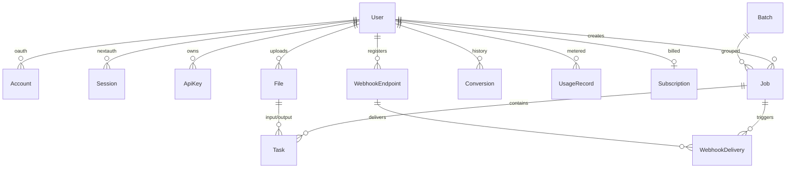

# Folio — Database Schema (Turso + Prisma)

> **Product:** Folio — document conversion platform.
> This document defines the Turso (SQLite via libSQL) database design: tables, relationships, indexes, and the migration strategy. Turso is chosen for edge-read latency, zero-ops, and cost predictability at the documented scale (see `plan/scalability-plan.md`). We use **Prisma ORM with the `@prisma/adapter-libsql` driver adapter**.
>
> **Design compliance:** the admin console and internal dashboards that surface this data implement the `design.md` design system (restrained palette, Inter, sharp architectural shapes).

---

## 1. Overview & Conventions

- **Database engine:** SQLite (Turso) in **WAL mode**, `synchronous=NORMAL`. Turso is a distributed SQLite: a primary (writer) node per region with read replicas.
- **Keys:** all primary keys are `String` UUIDs (v7 for time-ordered indexing) generated application-side — avoids autoincrement races across replicas and enables offline/batch inserts.
- **Timestamps:** `DateTime` stored as INTEGER (Unix ms) by Prisma's SQLite driver; all timestamps are UTC.
- **Soft deletes:** rows that must be auditable (files, jobs) use `deletedAt`; hard deletes only for user PII erasure (GDPR).
- **JSON columns:** engine options, task payloads, webhook headers stored as `String` containing JSON (SQLite has no native JSON type); validated at the application layer with Zod.
- **Money/credits:** integer credits, never floats.

> **Multi-tenancy note:** at the documented scale (1M conversions/mo) a single database is sufficient. Turso's model supports **database-per-tenant or shard-by-user-hash** when we exceed ~100M rows; the schema is designed so every hot table carries `userId` for sharding later (see `plan/scalability-plan.md` §Database Sharding).

---

## 2. Entity Relationship Diagram



**Core tables:** `User`, `Account`, `Session`, `VerificationToken`, `ApiKey`, `File`, `Batch`, `Job`, `Task`, `Conversion`, `UsageRecord`, `Subscription`, `WebhookEndpoint`, `WebhookDelivery`.

---

## 3. Full Prisma Schema

```prisma
// prisma/schema.prisma
generator client {
  provider = "prisma-client-js"
}

datasource db {
  provider = "sqlite"
  url      = env("DATABASE_URL") // libSQL URL (turso://...) via adapter
}

// ---------------------------------------------------------------------------
// Auth (NextAuth.js v5, JWT sessions — sessions table kept for auditability)
// ---------------------------------------------------------------------------

model User {
  id            String   @id @default(uuid())
  email         String   @unique
  name          String?
  image         String?
  passwordHash  String? // reserved for email+password (not enabled at launch)
  role          String   @default("user") // user | admin
  plan          String   @default("free") // anon | free | pro | business | enterprise
  credits       Int      @default(20)
  locale        String   @default("en")
  createdAt     DateTime @default(now())
  updatedAt     DateTime @updatedAt
  deletedAt     DateTime? // GDPR erasure marker

  accounts       Account[]
  sessions       Session[]
  apiKeys        ApiKey[]
  files          File[]
  jobs           Job[]
  conversions    Conversion[]
  usage          UsageRecord[]
  subscription   Subscription?
  webhooks       WebhookEndpoint[]
}

model Account {
  id                String  @id @default(uuid())
  userId            String
  type              String
  provider          String
  providerAccountId String
  refresh_token     String?
  access_token      String?
  expires_at        Int?
  token_type        String?
  scope             String?
  id_token          String?
  session_state     String?

  user User @relation(fields: [userId], references: [id], onDelete: Cascade)

  @@unique([provider, providerAccountId])
  @@index([userId])
}

model Session {
  id           String   @id @default(uuid())
  sessionToken String   @unique
  userId       String
  expires      DateTime

  user User @relation(fields: [userId], references: [id], onDelete: Cascade)

  @@index([userId])
}

model VerificationToken {
  identifier String
  token      String   @unique
  expires    DateTime

  @@unique([identifier, token])
}

// ---------------------------------------------------------------------------
// API keys (scoped, hashed at rest — see documentation/security.md §API Keys)
// ---------------------------------------------------------------------------

model ApiKey {
  id          String    @id @default(uuid())
  userId      String
  name        String
  keyPrefix   String    // first 8 chars, for display: "folio_live_ab12cd34"
  keyHash     String    @unique // SHA-256 of the full key
  scopes      String    // JSON array: ["jobs:read","jobs:write",...]
  lastUsedAt  DateTime?
  expiresAt   DateTime?
  createdAt   DateTime  @default(now())
  revokedAt   DateTime?

  user User @relation(fields: [userId], references: [id], onDelete: Cascade)

  @@index([userId])
  @@index([keyHash])
}

// ---------------------------------------------------------------------------
// Files (immutable objects in R2; row = metadata + lifecycle)
// ---------------------------------------------------------------------------

model File {
  id              String    @id @default(uuid())
  userId          String?   // null = anonymous guest
  storageKey      String    @unique // "files/<uuid>/<uuid>.docx" — path-safe, no user input
  bucket          String    @default("folio-files")
  filename        String    // original name (display only)
  mimeType        String
  sizeBytes       Int
  checksumSha256  String    // integrity + dedupe
  pageCount       Int?
  width           Int?      // images
  height          Int?
  status          String    @default("uploading") // uploading | ready | processing | done | error | expired
  source          String    @default("upload")    // upload | drive | dropbox | url | output
  retentionUntil  DateTime  // computed from plan: anon 1h / free 24h / paid 7d
  createdAt       DateTime  @default(now())
  deletedAt       DateTime?

  user    User?   @relation(fields: [userId], references: [id])
  inputs  Task[]  @relation("TaskInput")
  outputs Task[]  @relation("TaskOutput")

  @@index([userId, createdAt])
  @@index([status, retentionUntil]) // sweeper query
  @@index([checksumSha256])
}

// ---------------------------------------------------------------------------
// Jobs & Tasks (the processing graph — CloudConvert-inspired model)
// ---------------------------------------------------------------------------

model Batch {
  id        String    @id @default(uuid())
  userId    String?
  name      String?
  fileCount Int       @default(1)
  status    String    @default("queued") // queued | processing | done | partial | error
  createdAt DateTime  @default(now())

  jobs Job[]
  @@index([userId, createdAt])
}

model Job {
  id           String    @id @default(uuid())
  userId       String?
  batchId      String?
  status       String    @default("queued") // queued | processing | done | error | cancelled
  priority     Int       @default(0)        // Bull priority
  idempotencyKey String? @unique
  errorCode    String?
  errorMessage String?
  creditsCharged Int     @default(0)
  timingsMs    String?   // JSON: { enqueue, claim, engine, total }
  createdAt    DateTime  @default(now())
  startedAt    DateTime?
  endedAt      DateTime?

  user    User?   @relation(fields: [userId], references: [id])
  batch   Batch?  @relation(fields: [batchId], references: [id])
  tasks   Task[]

  @@index([userId, createdAt])
  @@index([status, createdAt]) // dashboard + sweeper
  @@index([batchId])
}

model Task {
  id           String    @id @default(uuid())
  jobId        String
  operation    String    // import | convert | optimize | merge | split | rotate | watermark | ocr | export
  engine       String?   // libreoffice | pdf-lib | pdfjs | sharp | tesseract | puppeteer | mammoth
  engineVersion String?  // pinned LibreOffice version
  inputFileId  String?
  outputFileId String?
  options      String?   // JSON: per-operation options (watermark text, rotate deg, split ranges…)
  status       String    @default("waiting") // waiting | processing | finished | error | cancelled
  progress     Int       @default(0)         // 0–100
  errorCode    String?
  errorMessage String?
  retries      Int       @default(0)
  createdAt    DateTime  @default(now())
  startedAt    DateTime?
  endedAt      DateTime?

  job      Job  @relation(fields: [jobId], references: [id], onDelete: Cascade)
  input    File? @relation("TaskInput", fields: [inputFileId], references: [id])
  output   File? @relation("TaskOutput", fields: [outputFileId], references: [id])

  @@index([jobId])
  @@index([status, createdAt])
  @@index([inputFileId])
  @@index([outputFileId])
}

// ---------------------------------------------------------------------------
// Conversion history (user-facing; also the audit trail)
// ---------------------------------------------------------------------------

model Conversion {
  id            String    @id @default(uuid())
  userId        String?
  jobId         String?
  sourceFormat  String    // "docx"
  targetFormat  String    // "pdf"
  engine        String
  location      String    // "client" | "server"
  status        String    // done | error | cancelled
  inputBytes    Int?
  outputBytes   Int?
  durationMs    Int?
  creditsUsed   Int       @default(1)
  createdAt     DateTime  @default(now())

  user User? @relation(fields: [userId], references: [id])

  @@index([userId, createdAt]) // history page (paged by createdAt desc)
  @@index([sourceFormat, targetFormat]) // conversion analytics
}

// ---------------------------------------------------------------------------
// Metering & billing
// ---------------------------------------------------------------------------

model UsageRecord {
  id           String   @id @default(uuid())
  userId       String?
  date         String   // "YYYY-MM-DD" (UTC) — one row per user per day per metric
  conversions  Int      @default(0)
  bytesIn      Int      @default(0)
  bytesOut     Int      @default(0)
  creditsUsed  Int      @default(0)
  apiCalls     Int      @default(0)
  updatedAt    DateTime @updatedAt

  user User? @relation(fields: [userId], references: [id])

  @@unique([userId, date])
  @@index([date]) // global daily rollup (cron → aggregate table)
}

model Subscription {
  id            String    @id @default(uuid())
  userId        String    @unique
  provider      String    // stripe
  providerSubId String    @unique
  plan          String    // pro | business | enterprise
  status        String    // active | past_due | canceled | trialing
  credits       Int       @default(0) // metered pool for API plans
  currentPeriodEnd DateTime
  cancelAtPeriodEnd Boolean @default(false)
  createdAt     DateTime  @default(now())

  user User @relation(fields: [userId], references: [id], onDelete: Cascade)
}

// ---------------------------------------------------------------------------
// Webhooks (developer API)
// ---------------------------------------------------------------------------

model WebhookEndpoint {
  id          String    @id @default(uuid())
  userId      String
  url         String
  secret      String    // HMAC secret (shown once, stored hashed)
  events      String    // JSON: ["job.finished","job.error"]
  active      Boolean   @default(true)
  createdAt   DateTime  @default(now())

  user      User             @relation(fields: [userId], references: [id], onDelete: Cascade)
  deliveries WebhookDelivery[]

  @@index([userId])
}

model WebhookDelivery {
  id           String    @id @default(uuid())
  endpointId   String
  jobId        String?
  event        String
  payload      String    // JSON snapshot
  status       String    // pending | delivered | failed
  attempts     Int       @default(0)
  statusCode   Int?
  nextAttemptAt DateTime?
  createdAt   DateTime  @default(now())

  endpoint WebhookEndpoint @relation(fields: [endpointId], references: [id], onDelete: Cascade)

  @@index([endpointId, status, nextAttemptAt]) // retry sweeper
}
```

---

## 4. Relationships Summary

| Relationship | Cardinality | Notes |
|---|---|---|
| User → Account/Session | 1:N | NextAuth OAuth links; cascade delete |
| User → ApiKey | 1:N | Keys revoked, never deleted (audit) |
| User → File | 1:N | `userId` nullable → anonymous uploads |
| Batch → Job | 1:N | Batch conversion grouping |
| Job → Task | 1:N | Cascade delete |
| Task → File (input/output) | N:1 each | One file may feed many tasks (merge) |
| User → Conversion | 1:N | History + audit |
| User → UsageRecord | 1:N | Daily rollup per user |
| WebhookEndpoint → WebhookDelivery | 1:N | Retry queue |

---

## 5. Indexing Strategy

**Hot paths (verified by query plan in CI):**

1. **History page:** `@@index([userId, createdAt])` on `Conversion` — paged `WHERE userId = ? AND createdAt < ? ORDER BY createdAt DESC LIMIT 20`.
2. **Job polling/WS resume:** `@@index([userId, createdAt])` + `@@index([status, createdAt])` on `Job`.
3. **Retention sweeper:** `@@index([status, retentionUntil])` on `File` — `WHERE status IN ('ready','done') AND retentionUntil < now()`.
4. **Webhook retry:** `@@index([endpointId, status, nextAttemptAt])` on `WebhookDelivery`.
5. **Daily usage rollup:** `@@unique([userId, date])` on `UsageRecord` — upsert pattern, no scan.
6. **API key lookup:** `@@unique([keyHash])` on `ApiKey` — O(1) lookup for every API call.
7. **Dedupe:** `@@index([checksumSha256])` on `File` — dedupe identical uploads (documented optimization, `documentation/performance.md` §Deduplication).

**Deliberately NOT indexed:** `Task.options`, `WebhookDelivery.payload` (JSON blobs, never filtered).

---

## 6. Data Lifecycle & Pruning

- **Anonymous:** files + jobs + conversions rows purged after retention window (1 h). User rows not created for anonymous sessions.
- **Free/paid:** files purged after plan retention (24 h / 7 d); **jobs/tasks/conversions rows retained 90 days** for audit, then archived to cold storage (Turso → R2 Parquet export via cron, then purged).
- **Users:** hard delete on GDPR erasure request: all rows with `userId` cascade-deleted; `File` objects purged from R2; `Conversion`/`UsageRecord` rows deleted (no analytics retention beyond anonymized aggregates).
- **Sweeper** (Bull repeatable job, every 15 min):
  1. `SELECT id FROM File WHERE status IN ('ready','done') AND retentionUntil < now()` → delete R2 objects → delete rows.
  2. `SELECT id FROM Job WHERE status IN ('done','error') AND createdAt < now() - 90 days` → archive → delete.
  3. `WebhookDelivery` where `status='failed' AND createdAt < now() - 7d` → delete.

---

## 7. Migration Strategy

1. **Local dev:** `prisma migrate dev` against a local SQLite file; schema checked into the repo.
2. **Staging:** `prisma migrate deploy` in CI against a Turso staging database.
3. **Production:** `prisma migrate deploy` in a GitHub Actions step with `DATABASE_URL` from secrets; runs **before** the app release step (expand phase).
4. **Expand/contract:** additive migrations first (new columns nullable, new tables), backfill, then a follow-up release removes old columns — SQLite `ALTER TABLE` supports `ADD COLUMN` but **not** `DROP COLUMN` in older versions; for column drops we recreate the table (Prisma generates the `--recreate` path) during a low-traffic window.
5. **Turso specifics:** `turso db shell` for ad-hoc inspection; **multi-region replicas** are configured via `turso db locations add <code>` — schema is replicated automatically (single-writer primary). Schema changes require the primary; brief write blips are acceptable at our write volume.
6. **Zero-downtime rule:** no migration may depend on app code that isn't deployed yet (migrate → deploy → backfill → cleanup).
7. **Rollback:** each release ships the previous migration hash; rollback = `prisma migrate resolve` + redeploy previous image. Destructive migrations (table recreation) are only run in the maintenance window documented in `documentation/deployment.md` §Rollback.

---

## 8. Seeding & Reference Data

- **Seed script** (`prisma/seed.ts`) creates: admin user, default feature flags, and a **conversion catalog snapshot** (`ConversionDef[]` → JSON config) so the API can serve `GET /api/v1/formats` without importing app code into migrations.
- Feature flags live in a `FeatureFlag` table (key/value) — used for canary releases (e.g., `new_libreoffice_engine: true` for 10% of users).

---

## 9. Backup & Recovery (summary)

Full details in `documentation/deployment.md` §Backup & Disaster Recovery. Summary:

- Turso **built-in automatic backups**: primary database snapshots every 6 h, retained 7 days (retention configurable via `turso db backups`).
- **Point-in-time recovery:** Turso maintains a WAL that supports restoring to any point in the retention window.
- **Cross-region restore:** manual `turso db fork` to a fresh region in a DR event; DNS switch at the CDN.
- R2 objects are the source of truth for files — the DB is re-creatable state (jobs/tasks) plus metadata. **R2 versioning** is enabled on the bucket (30-day lifecycle) as the file-level DR mechanism.
