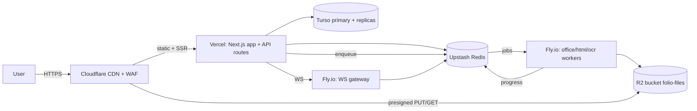

# Folio — Deployment Guide

> **Product:** Folio — document conversion platform.
> Production deployment: Vercel (web + API), Fly.io (workers + WebSocket gateway), Turso (database), Upstash (Redis), Cloudflare R2 (storage), Cloudflare CDN in front. Includes CI/CD, environment configuration, backup/disaster recovery, monitoring, and cost estimates.
>
> **Design compliance:** the public status page (`status.folio.app`) and deployment dashboards follow the `design.md` design system (calm white canvas, muted text, accent used only for incidents).

---

## 1. Topology



---

## 2. Environments

| Env | Purpose | Turso | R2 bucket | Notes |
|---|---|---|---|---|
| `development` | local (docker-compose) | local libSQL | MinIO | `NODE_ENV=development` |
| `preview` | per-PR (Vercel preview) | shared staging | `folio-staging` | migrations NOT auto-run |
| `staging` | pre-prod, CI deploys | staging primary | `folio-staging` | full test suite runs here |
| `production` | live | prod primary (us-east) + EU/APAC replicas | `folio-files` | guarded deploys |

**Promotion:** `main` → staging → (smoke) → production via manual approval. Preview environments get seeded sample data + sandbox API keys.

---

## 3. Vercel Setup

1. Import the repo (`apps/web` as root). Framework preset Next.js.
2. **Environment variables:** all from `technical-specifications.md` §5.1 (production scope), with preview/dev variants. Secrets via Vercel dashboard or `vercel env add` in CI.
3. **Region:** `iad1` (us-east-1) — collocated with Turso primary + nearest R2.
4. **Concurrency/limits:** functions default; set `maxDuration` on worker-triggering routes only (they're fast — queue enqueue is ms).
5. **Protection:** production domain `folio.app` + `api.folio.app` (separate project for the API origin, or path-rewritten); enforce HTTPS + HSTS.
6. **Deployment protection** on previews (Vercel auth) so secrets/branches aren't exposed.

> **api.folio.app:** we deploy the same Next.js app to a second Vercel project with `NEXT_PUBLIC_APP_URL=...` and only the `app/api` + `app/ws` routes enabled (route exclusion via `config`), so API traffic never pays for marketing SSR.

---

## 4. Database Setup (Turso)

```bash
# install CLI
curl -sSfL https://get.turso.tech | bash

# create databases (primary per region)
turso db create folio-prod --location us-east
turso db create folio-prod-eu --location eu-central
turso db create folio-prod-ap --location ap-southeast

# add read replicas to the primary
turso db locations add eu-central --to folio-prod   # replica in Frankfurt
turso db locations add ap-southeast --to folio-prod # replica in Singapore

# scoped auth tokens (least privilege)
turso db tokens create folio-prod --role readwrite --expiration none -n "api-rw"
turso db tokens create folio-prod --role read -n "workers-ro"

# backups (built-in): snapshot every 6h, retain 7d (configurable)
turso db backups list folio-prod
```

**Migrations:** run by CI (`prisma migrate deploy`) **before** the app release step; never by developers against production. Verify with `prisma migrate diff` in staging. See `database-schema.md` §7 for expand/contract rules.

---

## 5. Redis (Upstash)

- Create `folio-prod` (1 GB, `us-east-1`). Enable TLS.
- `REDIS_URL` = `rediss://...` for the API; workers use the same instance (Bull queues + pub/sub + rate limits + cache).
- Queue key namespacing: `folio:bull:<engine>:*`, `folio:cache:*`, `folio:rl:*`, `folio:ws:*`.
- **Persistence:** Upstash default AOF — acceptable (queues are recoverable; jobs are re-enqueued on startup if stuck in `active`).

---

## 6. Object Storage (Cloudflare R2)

```bash
# bucket + API token (bucket-scoped, least privilege)
r2 bucket create folio-files
r2 bucket cors set folio-files --cors '[
  {"AllowedOrigins": ["https://folio.app", "https://api.folio.app"],
   "AllowedMethods": ["GET","PUT","HEAD"], "AllowedHeaders": ["*"], "MaxAgeSeconds": 3600}
]'
r2 bucket versioning enable folio-files          # DR: versioned objects, 30-day lifecycle
r2 bucket lifecycle add folio-files --expire-days 30 --prefix files/
```

- Objects are **private**; access exclusively via presigned URLs (15-min PUT, 60-s GET).
- CORS is scoped to our origins so browsers can't read/write the bucket from other sites.
- Versioning + 30-day lifecycle = the file-level DR backstop even if the sweeper fails.

---

## 7. Workers (Fly.io) + WebSocket Gateway

```bash
# fly.toml (office worker, abridged)
[build]
  dockerfile = "apps/workers/office/Dockerfile"
[env]
  LO_CONCURRENCY = "1"
  NODE_ENV = "production"
[[services]]
  internal_port = 8080
  protocol = "tcp"
[mounts]
  source = "folio_tmp"
  destination = "/tmp"
```

- **Autoscaling (KEDA-style via Fly Machines):** scale on Bull queue depth (`folio:bull:office:*:length`); min 2, max 32 per region; scale-down with 5-min cooldown.
- **Rolling deploys:** Fly rolling releases; drain workers (stop claiming) → finish in-flight jobs (graceful 30 s) → replace. `fly deploy` with zero-downtime checks.
- **Gateway:** 2 instances min per region behind Fly Anycast; stateless (Redis pub/sub); WS connections survive gateway restarts via reconnect.
- **Health checks:** `/healthz` (process) + `/readyz` (Redis, R2 reachable); Fly auto-restarts unhealthy machines.

---

## 8. CI/CD Pipeline (GitHub Actions)

```yaml
name: deploy
on:
  push: { branches: [main] }
  pull_request: { }

jobs:
  quality:              # lint · typecheck · vitest · audit · bundle-size
  integration:          # docker-compose: MinIO + Redis + libSQL → integration tests
  e2e:                  # Playwright on Vercel preview
  migrate-staging:
    needs: [quality, integration]
    if: github.ref == 'refs/heads/main'
    steps: [ prisma migrate deploy (staging) ]
  deploy-staging:
    needs: [migrate-staging]
    steps: [ vercel --prod --target staging ; fly deploy --config staging ]
  smoke-staging:
    needs: [deploy-staging]
    steps: [ Playwright smoke: convert docx→pdf, merge 2 PDFs, API job flow ]
  migrate-prod:
    needs: [smoke-staging]
    if: github.ref == 'refs/heads/main' && startsWith(github.event.head_commit.message, 'release:')
    environment: production
    steps: [ prisma migrate deploy (production) ]
  deploy-prod:
    needs: [migrate-prod]
    environment: production
    steps: [ vercel --prod ; fly deploy ; purge CDN cache for /api/v1/formats ]
```

**Rules:** deploys to production require an approved `release:` commit; DB migrations are always a separate step from app deploy; every step is re-runnable (idempotent).

---

## 9. Rollback

| Layer | Rollback |
|---|---|
| Web/API | `vercel rollback` (previous deployment is kept) — instant, no data impact |
| Workers | `fly rollback` — previous image with pinned engine versions |
| Schema | **No automatic rollback.** Migrations are expand-only in production; the "rollback" is the cleanup migration + redeploy. Destructive ops only in the maintenance window (§11). |
| R2/Redis | Data is ephemeral by design; nothing to roll back |

**Rule:** never roll back the app further than the schema (app must be ≥ schema in the expand/contract timeline).

---

## 10. Backup & Disaster Recovery

### 10.1 Backups

| Asset | Mechanism | RPO | RTO |
|---|---|---|---|
| Turso (primary) | Built-in snapshots every 6 h, 7-day retention + PITR via WAL | ≤ 6 h (PITR: minutes) | < 15 min |
| R2 objects | Bucket versioning + 30-day lifecycle | 0 (versioned) | < 5 min |
| Redis | Upstash AOF | ≤ 1 s | < 5 min |
| Code/CI | GitHub | — | — |

### 10.2 DR scenarios

1. **Turso primary failure (region outage):** `turso db fork folio-prod --from-backup` into a healthy region → point DNS at new primary → verify replicas → declare recovery. RTO < 30 min.
2. **R2 region issue:** R2 is multi-zone by design; on bucket-level failure, restore from versioned copies (30-day window) or cross-bucket replication (added in Phase 3, `plan/implementation-roadmap.md`).
3. **Full-region outage:** traffic fails over at Cloudflare (Argo/load-balancing) to a warm standby region with its own Turso replica + worker pool. Tested quarterly (game day).
4. **Redis loss:** Bull re-enqueues `active` jobs on worker restart (idempotent via `Idempotency-Key`); rate-limit counters reset (acceptable); WS subscriptions re-establish.

**DR runbook** (`ops/runbooks/`) is tested every quarter with a simulated regional outage; results recorded with time-to-recover metrics.

---

## 11. Maintenance Window

Destructive/risky operations (table recreation for column drops, engine major upgrades, R2 lifecycle changes):

- **Schedule:** Sundays 03:00–05:00 UTC (lowest traffic, EU+US).
- **Process:** announce 72 h prior on status page → freeze deploys → run maintenance (low-traffic throttling via Cloudflare rate rule) → verify dashboards → un-freeze.
- **Target:** zero user-visible impact; queued jobs hold (Bull) during the window.

---

## 12. Monitoring & Alerting (Deployment)

- **Synthetic checks** every minute from 3 regions: landing 200, `POST /v1/jobs` + convert flow, WS connect, upload presign. Down → PagerDuty page (escalation: 5 min / 15 min / 30 min).
- **Alert routing:** `#folio-oncall` (Slack) + PagerDuty; severity matrix in `ops/runbooks/`.
- **Status page:** `status.folio.app` (external) — incidents auto-posted from PagerDuty.
- **On-call:** weekly rotation; runbook links in every alert.

---

## 13. Infrastructure Cost Estimates

Launch scale ≈ 1M conversions/mo (mix: 70% client-side, 30% server-side):

| Item | Config | Est. monthly |
|---|---|---|
| Vercel | Pro plan, 1M serverless invocations | $20–60 |
| Fly.io workers | 8× office (8-core/4GB) + 4× ocr (8-core/8GB), regional | $600–900 |
| Upstash Redis | 1 GB, pro tier | $40 |
| Turso | primary + 2 replicas, 50 GB | $25–50 |
| Cloudflare R2 | 10 TB stored, ~2 TB/mo writes | $60–120 |
| Cloudflare CDN | Free–Pro (bandwidth ~0: zero-egress R2) | $0–20 |
| Observability | Sentry Team + Grafana Cloud + PostHog | $100–150 |
| Email (Resend) | 100k emails/mo | $20 |
| **Total** | | **≈ $900–1,400/mo** |

At 10M conversions/mo: workers scale to ~40 cores (≈ $2.5–3.5k), storage/R2 ~3×, everything else roughly linear; unit economics stay positive at current pricing (Pro $9/mo, Business $29/mo, API metered at $0.001–0.003/conversion). Full model + sensitivities in `plan/scalability-plan.md` §Cost model.

---

## 14. Go-Live Checklist

- [ ] DNS: `folio.app` + `api.folio.app` + `status.folio.app` → Cloudflare; TLS everywhere
- [ ] Vercel prod + staging + preview projects configured; env vars scoped
- [ ] Turso primary + replicas live; tokens least-privilege; backups verified by restore drill
- [ ] Upstash Redis provisioned; queue namespaces confirmed
- [ ] R2 bucket: private, CORS scoped, versioning + lifecycle on
- [ ] Workers deployed (office/html/ocr) with pinned engines; health checks green
- [ ] CI/CD pipeline green end-to-end; migrate-before-deploy verified
- [ ] Monitoring: synthetic checks, SLO dashboards, alert routing, on-call rotation
- [ ] Security headers live (securityheaders.com A+); pen test scheduled
- [ ] Retention sweeper + DR game-day completed once
- [ ] Cost dashboard (CloudZero/Spreadsheet) tracking per-service spend
