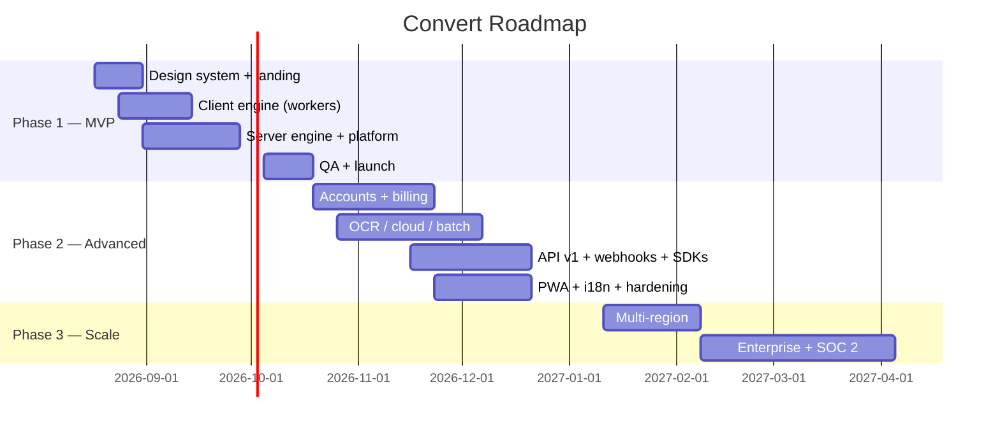

# Convert — Implementation Roadmap

> **Product:** Convert — document conversion platform.
> Phased delivery plan: **Phase 1 MVP** (core conversions), **Phase 2 Advanced** (accounts, OCR, cloud storage, API), **Phase 3 Scale & optimize** (enterprise, SOC 2, multi-region). Timelines assume a team of **4 engineers** (2 full-stack, 1 backend/workers, 1 frontend) + 1 designer/PM part-time.

---

## 1. Guiding Principles

1. **Private-by-default ships first.** Client-side conversions (merge/split/rotate/watermark/compress/image→PDF/PDF→text/image) are the differentiator, the cheapest to build, and de-risk the queue/worker stack.
2. **One conversion catalog from day one.** The `lib/conversions.ts` catalog drives UI, API validation, and docs — adding a conversion is a config change + engine adapter, not a feature rewrite.
3. **Queue-first backend.** Even a single-user MVP uses Redis + Bull, because retrofitting queues later is the most expensive refactor in this product class.
4. **Design system locked in Sprint 0.** Every screen implements `design.md` tokens — no bespoke styling later.
5. **Instrument before launch.** SLOs and dashboards exist before the public launch, not after.

---

## 2. Phase 1 — MVP: Core Conversions (Weeks 1–8)

**Goal:** a polished, private, single-page converter that handles the top 12 conversions, with guest sessions, retention, and monitoring. No accounts required.

### Scope

| Area | Deliverables |
|---|---|
| **Design system** | Tailwind tokens from `design.md`; Header/Hero/Footer; converter workspace; 12-col grid, Inter, dotted texture, accent CTA rules |
| **Client engine** | Web Worker pool (Comlink): pdf-lib (merge, split, rotate, watermark, compress), PDF.js (pdf→image, pdf→text, pdf→md), image→PDF (Sharp-WASM + pdf-lib) |
| **Server engine** | LibreOffice worker (Docker): docx/pptx/xlsx → pdf; pdf → docx/xlsx/pptx; txt/md/csv → pdf (via LO or Puppeteer for md); Puppeteer worker for html → pdf |
| **Platform** | Next.js app + `/api/v1` routes; Bull queue (office/html queues); presigned R2 upload/download; Turso + Prisma (jobs/tasks/files tables); retention sweeper; anonymous rate limiting (5/day/IP); WS progress + polling fallback |
| **Landing page** | design.md hero with image collage, conversion grid (editorial tiles), brand story, quote CTA, footer |
| **Quality** | Vitest unit + integration, Playwright E2E (convert flows), Lighthouse budgets, Sentry, basic Grafana dashboards |

### Explicitly out of scope

Accounts, history, OCR, cloud storage, API keys/webhooks, billing, batch, PWA offline, multi-region.

### Milestones

- **M1 (Wk 2):** design tokens + landing page hero & conversion grid live; client-side merge/split working in dev.
- **M2 (Wk 4):** full client engine + LibreOffice worker pipeline end-to-end (upload → job → convert → download) for 6 conversions.
- **M3 (Wk 6):** 12 conversions green in E2E; rate limiting, retention sweeper, monitoring live; staging environment.
- **M4 (Wk 8):** **MVP public launch** — LCP < 2.5 s, conversion success ≥ 99%, privacy page live, cost dashboard.

**Exit criteria:** all Phase 1 E2E tests pass in CI; p95 office conversion < 20 s; zero file-retention violations in audit logs; Lighthouse A.

---

## 3. Phase 2 — Advanced Features (Weeks 9–20)

**Goal:** a complete product with accounts, history, OCR, cloud storage, batch, billing, API v1, and PWA offline.

### Workstreams (parallelizable)

| Workstream | Deliverables | Est. |
|---|---|---|
| **Accounts & billing** | NextAuth (Google/GitHub/magic link), plans (free/pro/business), Stripe subscriptions + metered credits, usage rollup, quota enforcement, account deletion (GDPR) | Wk 9–13 |
| **History & files** | History page (paged), re-download within retention, file management, deletion flows, dedupe | Wk 10–12 |
| **OCR** | Tesseract worker (native), pdf→docx/xlsx with OCR, "Make searchable PDF", language config, page budgets | Wk 11–15 |
| **Cloud storage** | Google Drive + Dropbox OAuth import/export; revoke UI | Wk 13–16 |
| **Batch + ZIP** | Batch jobs (≤50 files), per-file progress, client-side ZIP download | Wk 12–14 |
| **API v1 + webhooks** | Full `api-documentation.md`: jobs/tasks, files, formats, usage, webhooks with HMAC, scoped API keys, SDKs (Node/TS, Python) + CLI, OpenAPI spec, sandbox env | Wk 14–19 |
| **PWA + offline** | App shell, service worker, IndexedDB offline queue for client conversions | Wk 15–17 |
| **i18n + SEO** | `en/de/es/fr/pt/ja` locale routes, hreflang, content pages, structured data | Wk 16–18 |
| **Hardening** | SSRF guards for import-url, pen-test prep, security headers audit, load test (k6) at 10× target | Wk 18–20 |

### Milestones

- **M5 (Wk 13):** accounts + billing live; quotas enforced; history shipped.
- **M6 (Wk 16):** OCR + cloud storage + batch live.
- **M7 (Wk 19):** API v1 GA (docs, SDKs, webhooks, sandbox); PWA + i18n live.
- **M8 (Wk 20):** **Phase 2 release** — public API launch + marketing push.

**Exit criteria:** 100% of `api-documentation.md` endpoints contract-tested; OCR accuracy ≥ 90% (F1) on test corpus; Stripe test-mode billing flows E2E green; external pen test (first pass) with no critical/high findings open.

---

## 4. Phase 3 — Scale & Optimize (Weeks 21–36+)

**Goal:** enterprise readiness, multi-region, SOC 2, and efficiency.

| Initiative | Deliverables | Window |
|---|---|---|
| **Multi-region** | Turso EU/APAC replicas + regional R2 + regional worker pools; regional API endpoints; EU data residency option | Wk 21–25 |
| **Scale-out** | KEDA-style autoscaling on queue depth; queue latency backpressure (503 + Retry-After); worker warm-pool tuning; R2 cross-bucket replication | Wk 22–26 |
| **Efficiency** | Output dedupe cache (same input+op within 24 h = 0 credits); engine upgrade canary pipeline; LibreOffice 8 eval; font matrix tests | Wk 24–28 |
| **Enterprise** | SSO (SAML/OIDC), client-side encryption for private flows, audit logs export, admin console, custom retention, dedicated capacity, SLA | Wk 26–32 |
| **Compliance** | SOC 2 Type II audit (controls already mapped); ISO 27001 candidate; bug bounty launch; quarterly DR game days | Wk 28–36 |
| **Mobile apps?** | Evaluate PWA-first (likely no native apps) — decision gate at Wk 30 | Wk 30 |

### Milestones

- **M9 (Wk 25):** multi-region live; load test at 10M conversions/mo headroom.
- **M10 (Wk 32):** enterprise features GA (first enterprise customer).
- **M11 (Wk 36):** SOC 2 Type II report issued; SLOs at 99.95% API / ≥99.5% conversion success.

---

## 5. Timeline Overview

**Key dates:** MVP launch **~Oct 12, 2026** · API GA **~Jan 2027** · SOC 2 report **~May 2027**.

---

## 6. Delivery Risks & Buffers

| Risk | Buffer |
|---|---|
| LibreOffice conversion-quality regressions (layout fidelity) | 2 weeks of engine QA embedded in Phase 1; golden-file corpus grows every sprint |
| Serverless API limits at scale | Queue-first design; API routes are I/O-only; no rewrite needed |
| Scope creep (accounts before value) | Phase 2 gated behind M4; product board rejects non-catalog features |
| OCR quality below promise | Phase 2: OCR ships with explicit "supported languages/DPI" doc + in-app guidance, not silent failure |
| Team variance | All milestones defined with exit criteria; staffing plan assumes 4 engineers — if 3, drop API GA to Phase 2.5 |

---

## 7. Definition of Done (per sprint)

- Feature merged behind flag or fully shipped; E2E + unit tests green in CI.
- Design tokens/components from `design.md` (no ad-hoc styling) — verified in review.
- Monitoring: metrics + logs + traces for the feature; alert defined where warranted.
- Docs: `documentation/` or `plan/` updated in the same PR where user-facing behavior changed.
- No high/critical `npm audit`; no PII in logs; accessibility checklist (keyboard + contrast) passed.
