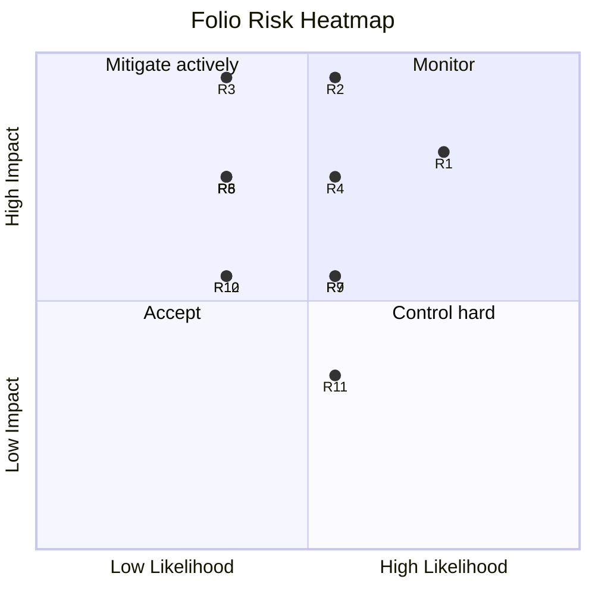

# Folio — Risk Assessment

> **Product:** Folio — document conversion platform.
> Technical risks, mitigation strategies, and contingency plans. Risks are scored **L (likelihood) × I (impact)** on a 1–5 scale; anything ≥ 8 is an active control with an owner and a review cadence. Re-reviewed each sprint and at every stage transition.

---

## 1. Risk Register

### R1 — LibreOffice conversion-quality regressions (layout fidelity)

- **L 4 / I 4 = 16 · High**
- **Description:** office→PDF/PDF→office conversions silently degrade (fonts, tables, tracked changes) after engine/OS/font updates. Quality *is* the product; silent regressions destroy trust (the exact failure mode competitors get panned for).
- **Mitigations:**
  - Golden-file corpus + thresholds in CI and in the **engine canary pipeline** (`testing-strategy.md` §4, §11).
  - Pinned engine versions per job (`engineVersion`), canary pool rollout for upgrades (`technical-specifications.md` §1).
  - Font matrix (Liberation/DejaVu + common corporate fonts) tested per release.
  - "Flatten layout" option + documented fidelity caveats (`user-guide.md` §5).
- **Contingency:** per-engine version pinning lets us instant-rollback LibreOffice 8 → 7.6 via config, not code; baseline corpus snapshots allow precise diff reporting.

### R2 — Malicious file exploits (office/PDF parsers)

- **L 3 / I 5 = 15 · High**
- **Description:** CVEs in LibreOffice/PDF.js/Tesseract/Chromium parsing untrusted documents; zip-bomb/PDF-bomb resource exhaustion; macro execution.
- **Mitigations:** sandboxed non-root workers with no egress except R2/Redis/DNS; macros disabled; seccomp; page/entry/size caps pre-engine; magic-byte validation; timeouts; `npm audit` + dependabot; DAST/SAST in CI (`security.md` §2, §12).
- **Contingency:** worker images are immutable + versioned → instant fleet rollback on CVE advisory; malicious-file outbreak runbook (quarantine engine version, replay corpus); bug bounty for disclosure pipeline.

### R3 — Data breach / privacy incident

- **L 2 / I 5 = 10 · High**
- **Description:** user documents or credentials exposed (DB leak, misconfigured R2 bucket, log leakage, staff access).
- **Mitigations:** private-by-default R2 + presigned URLs; SSE-S3 encryption; API keys hashed; logs redacted; PII-minimal schema; least-privilege tokens; quarterly DR/incident game days (`security.md` §7–11, `deployment.md` §10).
- **Contingency:** 72 h breach runbook (GDPR), key/bucket rotation playbooks, postmortem template, cyber-insurance review at Phase 2.

### R4 — Queue/worker starvation under viral traffic

- **L 3 / I 4 = 12 · High**
- **Description:** a spike (Product Hunt, HN, or a botnet) saturates workers; queues back up; user-facing "queued forever".
- **Mitigations:** queue-depth autoscaling with max caps; **backpressure** (503 + `Retry-After` beyond 5-min queue latency) instead of infinite queueing; anonymous rate limits + CAPTCHA; priority classes (paid > free > anon); load-tested spike scenario (`scalability-plan.md` §4).
- **Contingency:** emergency worker scale-out via one-click flyctl/terraform; degraded-mode toggle (disable OCR/PDF→PPTX, keep core conversions) served from config; status page incident template.

### R5 — Engine vendor/OSS dependency risk

- **L 2 / I 4 = 8 · High**
- **Description:** LibreOffice/Chromium/Tesseract upstream breakage, license changes, or abandonment; security-advisory droughts.
- **Mitigations:** pin + canary every engine; abstract engines behind adapters (`lib/engines/`) so a conversion's engine is swappable (e.g., add a commercial `office` engine like CloudConvert's dual-engine approach); OSS license audit in CI (FOSSA/ORT); SBOM per release.
- **Contingency:** secondary engine (e.g., `docx-preview`-based renderer or CloudConvert as fallback for office conversions) behind the same catalog — switch via config flag.

### R6 — Cloud/service outage (Vercel, Turso, Upstash, Cloudflare)

- **L 2 / I 4 = 8 · High**
- **Description:** provider regional outage takes down API, DB, or queue.
- **Mitigations:** multi-region Turso replicas + R2 replication (S1); Cloudflare failover; stateless API; DR runbooks + quarterly game day (`deployment.md` §10); degraded mode keeps client-side conversions working **even if the entire backend is down** — the differentiator saves the day.
- **Contingency:** DNS/load-balancer switch to standby region (RTO < 30 min DB, < 5 min compute); status page auto-posted.

### R7 — Cost blowout (worker fleet + storage)

- **L 3 / I 3 = 9 · Medium**
- **Description:** autoscaler runaway, storage retention failure, R2 egress surprise (only public buckets egress — we have none, but presign abuse could inflate PUTs).
- **Mitigations:** autoscaler max caps + cooldown; budget alerts at 70/85/100% on every service (CloudZero dashboard); dedupe + output cache; client-first nudging; quarterly cost review (`scalability-plan.md` §5.4).
- **Contingency:** emergency scale-down playbook; storage quota enforcement at upload; per-key abuse detection (bytes/conversion ratios).

### R8 — Regulatory/compliance miss (GDPR/CCPA/accessibility)

- **L 2 / I 4 = 8 · Medium**
- **Description:** erasure request mishandled, missing EU residency, WCAG lawsuit, cookie-consent violation.
- **Mitigations:** GDPR/CCPA flows built into the product (delete/export/residency, `security.md` §8); DPA + vendor register; WCAG 2.1 AA as a product requirement with axe in CI (design.md §27); consent-first analytics.
- **Contingency:** legal counsel on retainer (Phase 2); documented erasure SLA (≤ 30 days, target 72 h); accessibility audit before launch.

### R9 — API abuse / key leakage at scale

- **L 3 / I 3 = 9 · Medium**
- **Description:** stolen API keys (client bundles, logs) burned for free conversions; key rotation friction; webhook endpoint abuse.
- **Mitigations:** scoped keys + instant revocation + expiry + `lastUsedAt`; keys never in logs (redaction) or query strings; per-key rate limits + abuse detection; webhook URL must be https + HMAC; rotation UX in dashboard (`api-documentation.md` §1, `security.md` §5).
- **Contingency:** mass-revoke tooling for breached-key cohorts; IP allowlisting for enterprise keys (Phase 3).

### R10 — Team/key-person risk

- **L 2 / I 3 = 6 · Medium**
- **Description:** the worker/engine expertise concentrates in one engineer; bus factor = 1 on the queue pipeline.
- **Mitigations:** runbooks for everything (deploy, rollback, incident); docs in this repository are the knowledge base; pairing on engine work; on-call rotation with shadowing.

### R11 — Scope creep / roadmap drift

- **L 3 / I 2 = 6 · Medium**
- **Description:** accounts/OCR/API features leak into the MVP, delaying launch.
- **Mitigations:** Phase gates with exit criteria (`implementation-roadmap.md` §2–3); product board rejects non-catalog features; "explicitly out of scope" lists per phase; Definition of Done includes docs.

### R12 — SEO/marketing dependence (organic traffic risk)

- **L 2 / I 3 = 6 · Medium**
- **Description:** the conversion space is SEO-competitive (Smallpdf etc.); Google algorithm changes could cut organic traffic.
- **Mitigations:** multiple channels (API/developer community, integrations — Zapier/n8n, PWA installs, referral); content pages with genuine utility (guides, comparisons) following editorial design; programmatic SEO for 28 tools × locales; API developer funnel as a channel independent of SEO.

---

## 2. Risk Heatmap

---

## 3. Top-5 Active Controls (owners)

| # | Control | Owner | Cadence |
|---|---|---|---|
| 1 | Golden-file corpus + engine canary pipeline | Backend lead | every PR + every engine change |
| 2 | Worker sandbox + upload validation suite | Security lead | every PR + on engine change |
| 3 | Queue autoscaling + backpressure + load tests | Platform lead | every release + stage transition |
| 4 | Incident runbooks + quarterly game days | Platform lead | quarterly |
| 5 | Budget alerts + cost review | PM | monthly + quarterly deep dive |

---

## 4. Contingency Playbook Summary

| Event | Immediate action | Recovery | Owner |
|---|---|---|---|
| Engine regression (R1) | Pin previous `engineVersion` via config → 100% | Baseline corpus diff → fix/canary | Backend |
| Malicious-file outbreak (R2) | Quarantine engine version; block file signatures | CVE patch → corpus replay → resume | Security |
| Data breach (R3) | Activate 72 h runbook; rotate secrets/keys | Forensics → notify → postmortem | Security + PM |
| Traffic spike (R4) | Scale workers (one-click); enable degraded mode | Soak → scale down | Platform |
| Provider outage (R6) | Fail over region (DNS/LB) | Restore → game-day review | Platform |
| Cost runaway (R7) | Scale-down playbook; enforce quotas | Root-cause → alert tuning | PM |
| Key leak (R9) | Mass-revoke cohort; rotate affected keys | Abuse analysis → hardening | Backend |

---

## 5. Review Cadence

- **Every sprint:** risk register re-scored; new risks from incidents/retros added; owners confirmed.
- **Stage transitions** (S0→S1→S2): full re-assessment + load-test + capacity model refresh (`scalability-plan.md` §7 triggers).
- **Post-incident:** postmortem within 5 working days → risk register updated with new controls.
- **Quarterly:** external perspective (pen test, architecture review) folded in.

---

## 6. Accepted Risks (deliberate)

- **SQLite single-writer at S0/S1** — accepted with replicas; write rate is naturally low (~2 writes/conversion); sharding plan exists for S2 (R-trigger documented).
- **Third-party OSS engines** (LibreOffice/Chromium/Tesseract) — accepted with pinning, canaries, and a swappable adapter layer (R5).
- **Relying on Cloudflare/Upstash/Turso as managed providers** — accepted for operational leverage; DR story + quarterly game days keep the residual risk bounded (R6).
