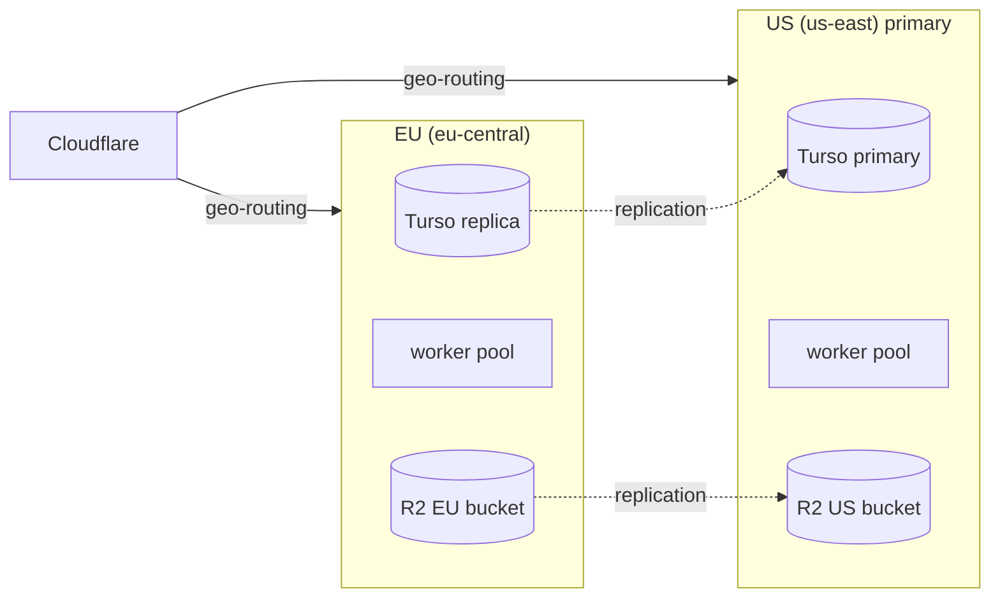

# Folio — Scalability Plan

> **Product:** Folio — document conversion platform.
> Growth strategy from launch (1M conversions/mo) to 100M conversions/mo: horizontal scaling, database sharding, load testing, capacity planning, and the cost model. This plan assumes the architecture in `documentation/architecture.md` and the load baseline in `documentation/performance.md` §9.
>
> **Design compliance:** internal scaling/ops dashboards follow the `design.md` design system (tokens, typography, restrained accent for alert states).

---

## 1. Growth Stages

| Stage | Scale | Key posture |
|---|---|---|
| **S0 Launch** | ≤ 1M conv/mo | Single-region (us-east), queue-autoscaled workers, Turso primary + replicas |
| **S1 Growth** | 1–10M conv/mo | Multi-region (EU/APAC), regional worker pools, dedupe + output cache, R2 replication |
| **S2 Scale** | 10–100M conv/mo | Sharded Turso, per-engine queue farms, capacity reservation, enterprise capacity |

**Trigger points** (hard gates that force the next stage): queue latency p95 > 60 s despite max autoscale (S0→S1); Turso primary write p95 > 20 ms or DB > 100 GB (S1→S2); Redis CPU > 60% sustained.

---

## 2. Horizontal Scaling Strategy

### 2.1 Stateless tiers (scale trivially)

- **API (Vercel):** serverless — scales with traffic automatically; only I/O (Redis/Turso/R2 presign). No affinity, no local state.
- **WebSocket gateway (Fly.io):** stateless pods behind anycast; connection state in Redis; scale on concurrent-connection count (alert at 80% of pod limit).
- **Workers (Fly.io):** the only CPU-bound tier. **Autoscale on Bull queue depth** per engine family:

```yaml
# KEDA-style policy (Fly Machines autoscaler)
scaling:
  metric: bull_queue_depth        # folio:bull:office:*:length
  min: 2
  max: 32
  cooldown: 300s
  target: 4                       # 4 queued jobs per worker → scale up
```

Each worker runs `LO_CONCURRENCY=1` (one LibreOffice conversion at a time) — CPU isolation is the reliability lever; don't oversubscribe cores.

### 2.2 Redis

- Upstash scales vertically to start; **split by purpose** before sharding: `queue` (Bull), `cache`, `rate-limit`, `ws` (pub/sub) into separate instances to isolate blast radius and eviction policies.
- Bull queues are **per engine family** (`office`, `html`, `ocr`, `img`) — no queue thundering.
- Rate-limit counters: hash-slot friendly keys (`rl:{userId}:{window}`), never SCAN.

### 2.3 R2

- Zero-egress is the moat; at S1 enable **cross-bucket replication** to a second region for DR.
- Presigned URLs keep all traffic off the API tier; at S2 consider **R2 public buckets with signed cookies** for very large outputs (> 1 GB) to reduce presign churn.

---

## 3. Database Scaling (Turso)

### 3.1 Stage S0 → S1: read replicas

- Reads (history, dashboard, webhook replay, `GET /v1/jobs` polling) go to **regional replicas** (EU/APAC for latency); writes to the single primary.
- Prisma routing: explicit `replica` connection string for read models; the job write path stays on the primary.
- **Write rate is naturally low:** ~2 writes per conversion (job create + update) + usage rollup. Even 10M conv/mo ≈ 25 writes/s — far below SQLite's practical ceiling when batched.

### 3.2 Stage S2: sharding

SQLite's single-writer model caps throughput; when the primary approaches saturation we shard:

- **Shard key:** `userId` hash (buckets of 16), consistent hashing with virtual nodes.
- **Shard scope:** `jobs`, `tasks`, `conversions`, `usage` (all carry `userId` — the schema was designed for this, `database-schema.md` §1). **Global tables stay unsharded:** `User` (auth), `ApiKey`, `File` metadata can follow the owning user's shard; catalog/flags remain global.
- **Routing:** a `ShardRouter` service maps `userId → shard` (bucketed), cached in Redis; middleware attaches the shard to queries.
- **Cross-shard queries are forbidden** by design: history/usage are always user-scoped. Admin analytics read from the daily rollup table (aggregated into a global stats DB), never cross-shard.
- **Migration path:** logical copy per shard from the primary (frozen snapshot + WAL catch-up), verified by checksum reconciliation, then cut over per-shard (canary shard first).

### 3.3 Capacity envelope (Turso)

| Metric | S0 | S1 | S2 |
|---|---|---|---|
| DB size | < 20 GB | < 100 GB | sharded |
| Writes/s (peak) | < 10 | < 40 | 25/s per shard |
| Read replicas | 2 | 5 (3 regions) | per-shard replicas |
| Query p95 (reads) | < 10 ms | < 15 ms | < 15 ms |

---

## 4. Load Testing (k6)

### 4.1 Scenarios (in `plan/testing-strategy.md` §6)

| Scenario | Shape | Pass criteria |
|---|---|---|
| Baseline | 1,000 VU × 30 min, 60% client-conv mix | enqueue→done p95 < 20 s (office), < 4 s (client); success ≥ 99% |
| Soak | 500 VU × 6 h | flat queue depth; worker RSS stable; no R2 5xx |
| Spike | 100 → 5,000 VU in 2 min | graceful 503 + `Retry-After`; recovery < 5 min; no OOM |
| Capacity | incremental until failure | documented breaking point + headroom report |

### 4.2 What we measure

Queue depth/latency per engine, worker CPU/mem, Redis ops/s + evictions, Turso write latency, R2 PUT/GET p95, WS fan-out latency, end-to-end job duration, cost-per-conversion under load.

### 4.3 Test harness

- `k6` scripts in `ops/load/`; runs against a **dedicated load environment** (separate Turso/R2/workers) so production is never affected.
- Realistic mix from RUM: ~70% client-side conversions, ~30% server; file sizes from production distribution (2–50 MB).
- Load-test report published per release in Phase 3 (and before S0→S1 trigger).

---

## 5. Capacity Planning Model

### 5.1 Worker math

One office worker (8-core/4 GB) ≈ **6–8 conversions/min** (p50 4–6 s incl. overhead, ~70% duty cycle). For peak **8 conv/s** server-side (≈ 25M conv/mo with 30% server mix):

```
peak_rate × safety / throughput_per_worker = workers
8 × 2.5 (safety+spike) / 7 ≈ 3 → round to 12 workers (3× regional spread)
```

Autoscaling makes exact sizing moot; the model just sizes **max pools** and cost.

### 5.2 Redis sizing

- Queue payloads are tiny (job refs); rate-limit counters dominate. 1 GB covers ~50M counters/day. Budget: 1 GB S0 → 3 GB S1 → split instances S2.

### 5.3 Cost model (indicative, per month)

| Scale | Workers | Redis | Turso | R2 (store + egress) | Total infra |
|---|---|---|---|---|---|
| 1M conv/mo | 12 cores | $40 | $50 | ~$100 | **≈ $1.2k** |
| 10M conv/mo | 60 cores | $150 | $250 (replicas) | ~$700 | **≈ $6–8k** |
| 100M conv/mo | 600 cores | sharded | sharded | ~$6k | **≈ $60–80k** |

Revenue at 10M conv/mo (mix of free/Pro/Business/API) supports this comfortably; unit economics validated quarterly (see `documentation/deployment.md` §13 for the detailed S0 table).

### 5.4 Cost levers (S1+)

1. **Output dedupe cache** (same input checksum + conversion + options within 24 h → 0 credits, reuse object) — cuts worker spend up to 30% on repeat users.
2. **Client-first nudging:** UI surfaces "On your device" conversions by default; every client conversion avoids ~0.3 s of worker time.
3. **Batch batching:** coalesce small LibreOffice jobs into a single `soffice` invocation with multiple files (profile startup amortized) — targeted for S2.
4. **Spot/preemptible workers** for non-OCR queues with Bull retry as the safety net (Phase 3 evaluation).

---

## 6. Multi-Region (S1)



- **Geo-routing at the CDN/API:** EU users land on EU endpoints (`eu-central.api.folio.app`); writes replicate to the US primary asynchronously — eventual consistency is acceptable because jobs are user-scoped and self-consistent.
- **Data residency:** EU customers pinned to EU region end-to-end (Turso replica + R2 EU bucket + EU workers) — the GDPR story from `documentation/security.md` §8.1.
- **Failover:** region health checks at Cloudflare; on EU failure, traffic shifts to US (RTO < 5 min, documented in `deployment.md` §10.2).

---

## 7. Sharding & Partitioning Triggers (S2 Checklist)

- [ ] Turso primary write p95 > 20 ms sustained, or DB > 100 GB
- [ ] Redis CPU > 60% sustained despite purpose-splitting
- [ ] Queue latency p95 > 60 s at max autoscale for 3 days
- [ ] Load test shows > 40% degradation vs S1 baseline

When triggered: shard-router service → bucket plan → frozen-snapshot copy → canary shard → staged cutover (per `database-schema.md` §7 expand/contract). Target zero-downtime cutover with per-shard backout.

---

## 8. KPIs & Scaling Health Dashboard

| Metric | Green | Yellow | Red |
|---|---|---|---|
| Queue latency p95 (office) | < 30 s | 30–60 s | > 60 s |
| Worker CPU | < 70% | 70–85% | > 85% |
| Turso primary write p95 | < 10 ms | 10–20 ms | > 20 ms |
| Redis memory | < 60% | 60–80% | > 80% |
| Conversion success | ≥ 99% | 98–99% | < 98% |
| Cost per 1k conversions | < $1.5 | $1.5–3 | > $3 |

**Quarterly capacity review:** traffic, cost, SLO burn, and trigger-point status → adjusts the plan. This document is a living artifact, updated at each stage transition.
