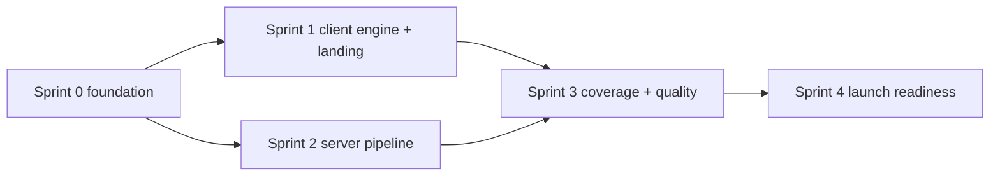

# Convert — Sprint Planning

> **Product:** Convert — document conversion platform.
> Agile breakdown for the MVP (Phase 1, weeks 1–8): sprint cadence **2 weeks**, 4 engineers, user stories with acceptance criteria and dependencies. Sprint 0 = foundation; Sprints 1–2 detailed below; Sprints 3–4 summarized with the same rigor (full backlog lives in Linear, linked from each sprint).

**Team:** 2 full-stack (A, B), 1 backend/workers (C), 1 frontend/design-system (D) + PM/design 0.5 FTE.

---

## Sprint 0 — Foundation (Week 1)

**Goal:** standing skeleton + design system; everything downstream depends on it.

| Story | Owner | Acceptance criteria |
|---|---|---|
| S0.1 Monorepo + CI | A | `npm workspaces`; GitHub Actions (lint/typecheck/vitest/build/audit) green on empty PR; `pnpm` lockfile |
| S0.2 Design tokens + base UI | D | Tailwind tokens from `design.md` §41; Inter via `next/font`; Header/Hero/Footer scaffold; spacing scale; radii ≤ 4px |
| S0.3 Next.js app + routes skeleton | A | App Router; `/` landing, `/convert` workspace, `/api/v1/*` route handlers stub; typed routes |
| S0.4 Local infra (docker-compose) | C | Redis + libSQL + MinIO up; `.env.example`; health checks |
| S0.5 Prisma schema v1 + migrate flow | C | `database-schema.md` §3 tables (jobs/tasks/files/…); `migrate dev` + `migrate deploy` paths work |
| S0.6 Conversion catalog | A+C | `lib/conversions.ts` with first 12 conversions; `GET /api/v1/formats` serves it; Zod schemas |
| S0.7 Observability skeleton | C | pino structured logs; Sentry; OTel endpoint wired; Grafana dashboards (empty) |

**Definition of done:** all CI green; design system visible on `/`; `GET /formats` returns catalog; infra boots in one command.

---

## Sprint 1 — Client Engine + Landing (Weeks 2–3)

### Sprint goal
The differentiator works: browser-side PDF utilities + an on-brand landing page.

| ID | User story | Acceptance criteria | Depends on |
|---|---|---|---|
| S1.1 | As a visitor, I can merge 2–10 PDFs by dropping them and reordering | Drag-drop reorder works; output PDF identical page order; runs in Web Worker; no network request to our API for the file | S0.6 |
| S1.2 | As a visitor, I can split a PDF by ranges (`1-3,4-5`) or per page | ZIP (client-side) or individual downloads; invalid ranges → inline error; 0 uploads | S1.1 |
| S1.3 | As a visitor, I can rotate selected pages 90/180/270° | Rotation matrix correct (Playwright visual test); selection UI keyboard-accessible | S1.1 |
| S1.4 | As a visitor, I can add a text watermark (size/opacity/rotation) | Watermark vector-rendered; output saved; text never leaves device | S1.1 |
| S1.5 | As a visitor, I can compress a PDF at low/medium/high/lossless | Size reduction ≥ 40% at "high" on corpus (avg); lossless preserves bytes where possible; done < 5 s for 50 MB | S1.1 |
| S1.6 | As a visitor, I can convert images (PNG/JPG/WebP) to PDF | Multi-select → one PDF, page order = selection; EXIF orientation respected; done on-device | S1.1 |
| S1.7 | As a visitor, I can extract text from a PDF | PDF.js worker returns `.txt`; UTF-8 preserved; copy-paste friendly | S1.1 |
| S1.8 | As a visitor, I land on a premium landing page | design.md hero (collage, dot texture, 2 CTAs), conversion grid with editorial tiles, brand story, CTA, footer; LCP < 2.5 s; CLS < 0.1 | S0.2 |
| S1.9 | As a visitor, I can reach any conversion tool in ≤ 2 clicks from the landing page | Nav + grid deep-link to `/convert?tool=pdf-merge`; mobile menu works | S1.8 |
| S1.10 | As a dev, I can rely on consistent engine results | Golden-file test corpus (20 docs) snapshot-tested for merge/split/rotate/watermark/compress | S1.1–1.7 |

**Retro/risks:** Worker memory ceilings on 300 MB PDFs (document fallback to server path); PDF.js WASM loading time on 4G.

---

## Sprint 2 — Server Engine + Platform (Weeks 4–5)

### Sprint goal
End-to-end server pipeline: upload → queue → LibreOffice convert → download, with progress and retention.

| ID | User story | Acceptance criteria | Depends on |
|---|---|---|---|
| S2.1 | As a visitor, I can convert Word/PPT/Excel → PDF | Presigned PUT upload; job created; progress via WS (and 2 s poll fallback); download within 60 s TTL; files purged after 1 h (anon) | S0.4–S0.7 |
| S2.2 | As a visitor, I can convert PDF → Word/Excel/PPT | LibreOffice reverse conversions; layout fidelity within golden-file thresholds; OCR **off** in MVP | S2.1 |
| S2.3 | As a visitor, I can convert TXT/MD/CSV → PDF | md rendered via Puppeteer (nice typography); txt/csv via LibreOffice; csv gets print-ready sheet layout | S2.1 |
| S2.4 | As a visitor, I can convert HTML → PDF | Puppeteer worker; inline CSS honored; `page-break` respected; no external network in worker | S2.3 |
| S2.5 | As an operator, I can see queue health | Bull dashboard (Bull Board) + Grafana: depth, p95 duration, success rate; alert on depth > 500 | S0.7, S2.1 |
| S2.6 | As an operator, I can trust retention | Sweeper deletes expired files (1 h anon) ≤ 15 min; R2 lifecycle backstop verified; audit log of deletions | S2.1 |
| S2.7 | As a dev, anonymous abuse is bounded | 5 conversions/day/IP + 3 concurrent; 429 with `Retry-After`; IP rate-limit tests green | S2.1 |
| S2.8 | As a visitor, I get clear errors | Error codes surfaced (`CONVERSION_FAILED`, `UNSUPPORTED_FORMAT`, `FILE_TOO_LARGE`…) with human copy per `user-guide.md` §5 | S2.1 |
| S2.9 | As a visitor, I can cancel a queued/in-flight conversion | Cancel button; job → cancelled; no charge; in-flight engine job killed via token | S2.1 |

**Dependencies:** S2.1 blocks S2.2–S2.9 (platform first). Parallel track: S2.5/S2.6/S2.7 can start as soon as S2.1's job model exists.

**Retro/risks:** LibreOffice profile-lock contention (mitigated: isolated profile per job at `LO_CONCURRENCY=1`); conversion quality on exotic fonts (font matrix corpus grows).

---

## Sprint 3 — Coverage + Quality (Weeks 6–7)

| ID | User story | Acceptance criteria |
|---|---|---|
| S3.1 | Full MVP catalog green (12 conversions) | Golden-file thresholds for each; E2E per conversion in CI |
| S3.2 | Email-to-paste flow polish (paste image → image→PDF) | Clipboard paste works; dropzone announces via ARIA |
| S3.3 | Error/empty/loading states on all surfaces | Skeleton loading (design.md §33), empty history, error banners with retry |
| S3.4 | Mobile responsive converter | design.md §15 single-column flow; touch targets ≥ 44 px |
| S3.5 | PWA app shell (installable, offline shell) | Manifest + service worker; Lighthouse PWA checks pass |
| S3.6 | Security hardening pass | `security.md` §12 pre-launch items done: headers, magic-byte checks, zip-bomb guard, worker sandbox |
| S3.7 | Load test baseline (k6) | 500 concurrent conversions; p95 enqueue→done under target; no queue starvation |

---

## Sprint 4 — Launch Readiness (Week 8)

| ID | Story | Acceptance criteria |
|---|---|---|
| S4.1 | Staging → prod pipeline hardened | `deployment.md` §8 pipeline green; migrate-before-deploy verified |
| S4.2 | Monitoring + on-call live | Synthetic checks 3 regions; alert routing; status page |
| S4.3 | Privacy + legal pages | Privacy policy (GDPR/CCPA), terms, cookie banner (consent), security.txt |
| S4.4 | Performance final pass | Lighthouse A; Web Vitals RUM enabled; bundle ≤ 170 KB gzip initial |
| S4.5 | Launch checklist sign-off | `deployment.md` §14 all checked; go/no-go meeting |

---

## Definition of Ready / Done (all sprints)

**Ready:** story has acceptance criteria + design link (design.md token/component names) + dependencies resolved; estimated 1–5 points.

**Done:** code merged to `main` behind flag if needed; unit + integration + E2E green; docs updated in same PR; monitoring/alert exists for new paths; no new high/critical audit findings; accessibility checklist passed (keyboard, contrast, ARIA); design review passed (tokens only, no ad-hoc values).

---

## Dependency Map (MVP)

**Critical path:** S0 → S2.1 (job platform) → S2.2–S2.9 → S3.7 (load) → S4. Anything not on the critical path (S1.8 landing, S3.5 PWA) is slack work for the frontend track.

---

## Velocity & Cadence Notes

- Assumed velocity: **28–35 points/sprint** (4 engineers, 2-week sprints). MVP ≈ 120 points.
- Standups daily; backlog grooming weekly; retro after each sprint.
- **Feature flags** (`FeatureFlag` table, `database-schema.md` §8) gate S2.2/S3.x behind canaries — nothing ships to 100% without a canary step in Phase 2+.
