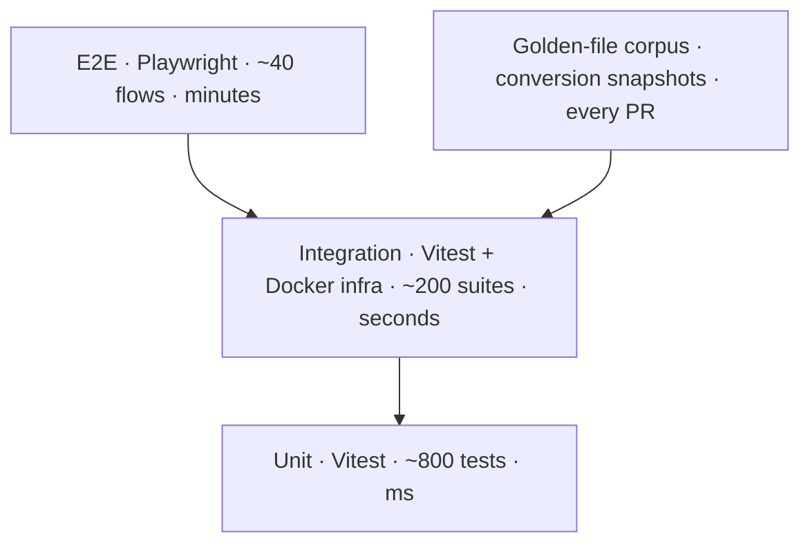

# Folio — Testing Strategy

> **Product:** Folio — document conversion platform.
> Comprehensive plan: unit, integration, E2E, performance, and security testing — mapped to the CI pipeline, with a golden-file conversion corpus as the backbone (conversion quality is the product).

---

## 1. Test Pyramid

**Principle:** conversion **quality** is tested by golden files (deterministic fixtures + thresholds), while *plumbing* is tested by fast unit/integration suites. We do not assert pixel-perfect output in E2E — we assert stable, human-verified snapshots of representative documents.

---

## 2. Unit Testing (Vitest)

**Where:** `lib/`, `workers/`, `components/` (pure logic), `app/api` handlers (mocked deps).

| Area | What we test | Examples |
|---|---|---|
| Conversion catalog | Validation, options schemas (Zod), limits | every catalog entry parses; `maxPages`/`maxSizeMB` enforced; unknown format → `UNSUPPORTED_FORMAT` |
| Job/task logic | State transitions, idempotency, credits | queued→processing→done; cancel rules (409 on terminal); idempotency key reuse returns original |
| Rate limiter | Sliding window correctness | burst/sustained math; header values; `Retry-After` |
| Webhook signing | HMAC build/verify, replay window | constant-time verify; tampered body rejected; ±5 min skew |
| Client engine (worker logic, node env) | pdf-lib ops on fixture PDFs | merge order, split ranges, rotate matrix, watermark placement, compress size delta, image→PDF page count |
| Retention sweeper | Selection + deletion queries | expired vs not; chunked deletes; R2 object removal called |
| Util | Checksums, dedupe, pagination cursors | cursor decode/encode stability |

**Coverage target:** ≥ 85% lines on `lib/` + API route logic (not UI).

---

## 3. Integration Testing (Vitest + Docker Compose)

Real Redis (Bull), real libSQL (Turso local), real MinIO (R2 stand-in) — no mocks for infrastructure.

| Suite | Covers |
|---|---|
| Upload flow | presign → PUT → `ready`; checksum dedupe; oversize 413; magic-byte rejection |
| Job pipeline | enqueue → worker claims → engine runs (fixture docx) → output in MinIO → job done → download URL |
| Queue semantics | priority (paid before free), concurrency limit, retry on transient engine error (once), stuck-job heartbeat timeout |
| WS gateway | subscribe/auth; progress events; reconnect replay; fallback polling parity |
| Rate limiting + quotas | per-key and per-IP counters; anonymous 5/day; 429 responses |
| Webhook delivery | delivery + HMAC; retry with backoff; permanent failure on 422 |
| Auth | NextAuth flows with real OAuth test harness; session expiry; key scopes (`jobs:read` blocked from `jobs:write` route) |
| Sweeper | expired file purge ≤ 15 min cycle; R2 lifecycle backstop simulated |

Run in CI on every PR (the `integration` job); full suite < 8 min.

---

## 4. Golden-File Conversion Corpus

The **corpus** (`test/fixtures/`) grows every sprint; each fixture has a human-approved reference output.

- **20 fixtures at MVP**, targeting: A4/Letter, portrait/landscape, tables, images, embedded fonts, CJK text, formulas, merged cells, multi-column, headers/footers, tracked changes, comments, password-protected PDF, scanned page, 200-page doc, 30 MB xlsx.
- **Assertions** (per conversion type, not pixel-identical):
  - `docx→pdf`: page count, text extraction spot-checks, embedded-font flag, size within ±15%.
  - `pdf→docx`: extractable text coverage ≥ 98% (non-scanned), table cell count within tolerance.
  - `xlsx→pdf`: sheet count, print-area rows.
  - merge/split/rotate/watermark: page count, order, rotation metadata, text presence.
- **Baseline refresh** is a deliberate PR (human review of diff) — never auto-commit drift.
- Run in CI (integration job) **and** in the engine-canary pipeline (`plan/implementation-roadmap.md` Phase 3) so LibreOffice upgrades are validated against the corpus before rollout.

---

## 5. E2E Testing (Playwright)

**Browsers:** Chromium, Firefox, WebKit (desktop + mobile viewports). Runs against Vercel preview deployments.

| Flow group | Key assertions |
|---|---|
| Landing (design.md) | hero renders (collage, CTAs), conversion grid links work, mobile menu, no CLS > 0.1, keyboard nav |
| Convert (client ops) | merge 3 PDFs → download; split ranges; rotate; watermark; compress size delta; image→PDF; pdf→txt; **assert zero upload network calls** (intercept & fail on R2/API PUT) |
| Convert (server ops) | docx→pdf: drop → progress → download; cancel mid-flight; error copy on corrupt file; anonymous quota → friendly upgrade prompt |
| Accounts | signup (magic link + Google harness), history paging, delete account (GDPR cascade), re-download within retention |
| Billing (test mode) | Stripe test card flows: upgrade, downgrade at period end, metered credit consumption, quota reset |
| API (SDK-driven) | Node SDK: upload → job → poll → download; webhook delivery + signature verify; rate-limit 429 handling; error codes |
| Accessibility | axe-core scan on every route: no critical violations; keyboard-only pass of convert flow |
| PWA | installable, offline convert (merge works offline), online sync |

**Flakiness policy:** network-isolated fixtures (no external fonts/images), retries ×2, flaky tests quarantined to a weekly triage.

---

## 6. Performance Testing

| Type | Tool | Scope | Pass criteria |
|---|---|---|---|
| Web Vitals (CI) | Lighthouse CI | Landing + convert | LCP < 2.5 s, CLS < 0.1, INP < 200 ms (mid-tier mobile, 4G throttle) |
| Browser perf trace | Playwright `performance` | Client conversions | merge 10×2 MB < 4 s p50; worker pool doesn't jank main thread (INP) |
| Load test | k6 (scripted scenarios) | API + queue + workers | See `scalability-plan.md` §Load testing |
| Endurance | k6 6 h soak | 50% sustained load | no queue growth, no memory leak (worker RSS stable), no R2 5xx |
| Stress | k6 spike ×10 | 2 min | graceful 503 + `Retry-After`, no OOM, recovery < 5 min |
| Capacity | k6 incremental | find breaking point | documented headroom numbers (report in `scalability-plan.md`) |

Performance regression budgets from `documentation/performance.md` §1 are **enforced in CI** (bundle size, asset weight, Vitals).

---

## 7. Security Testing

| Layer | Method | Cadence |
|---|---|---|
| SAST | CodeQL + ESLint security rules + `npm audit` | every PR (block high/critical) |
| DAST | OWASP ZAP against staging (auth included) | nightly + on release |
| Dependency | Renovate + `npm audit` + SBOM (CycloneDX) per release | continuous |
| Secret scanning | `gitleaks` in CI; GitHub secret scanning | every PR |
| Upload/engine attacks | Test corpus: zip-bomb, PDF-bomb (10k pages), polyglot, macro-bearing docx, malformed PDFs, HEIC bombs | every PR (integration) + on engine change |
| SSRF | import-url suite: private IPs, loopback, metadata IP, DNS rebinding, redirect chains | every PR |
| Auth/session | OAuth account-linking takeover test, JWT tamper, session revocation, magic-link replay | every PR |
| Rate-limit abuse | burst bypass attempts, IP rotation simulation, key revocation mid-flight | every PR |
| Webhook | signature forgery, replay outside ±5 min window, secret rotation | every PR |
| Pen test (external) | third-party pentest | Phase 2 launch + annually + on major auth/storage change |
| Bug bounty | HackerOne/private program | Phase 3 (post-SOC 2) |

**Red-team game day** (quarterly): simulated incident from `deployment.md` §Incident Response runbooks.

---

## 8. Test Environments & Data

| Env | DB | Storage | Engines | Notes |
|---|---|---|---|---|
| Unit | in-memory (mock) | — | — | ms-fast |
| Integration (CI) | local libSQL | MinIO | real (fixtures) | docker-compose, < 8 min |
| E2E (preview) | staging Turso | staging R2 | staging workers | seeded corpus files |
| Staging | staging Turso | staging R2 | staging workers | full suite before prod |
| Production | prod | prod | prod | RUM + synthetic only |

- **Test accounts:** seeded via `prisma/seed.ts` (admin, free, pro, anon).
- **Synthetic monitoring** (prod): 3-region checks every minute (convert flow, API, WS) — part of `deployment.md` §12.

---

## 9. Test Data Privacy

- Fixtures are **synthetic** (generated docs) — never real customer documents.
- Production data is never copied to staging; staging corpus is generated or sourced from public-domain samples.
- Golden files with sensitive-looking content are clearly synthetic.

---

## 10. Reporting & Quality Gates

| Gate | Blocks merge? | Blocks release? |
|---|---|---|
| Unit + integration green | ✅ | ✅ |
| Golden-file suite green | ✅ | ✅ |
| E2E smoke (conversion flows) | ✅ (on preview) | ✅ |
| Full E2E (all browsers) | — | ✅ |
| Vitals/bundle budgets | ✅ | ✅ |
| Audit (no high/critical) | ✅ | ✅ |
| Security suites (SSRF/abuse/webhook) | ✅ | ✅ |
| Pen test (no open critical/high) | — | ✅ (Phase 2+) |

**Release sign-off:** green on all gates + documented performance/security reports + on-call ready (see `deployment.md` §Go-Live).

---

## 11. Test Debt & Evolution

- Flaky-test quarantine queue with weekly triage (owner per flaky suite).
- Corpus grows +1–3 fixtures/sprint; golden baselines reviewed every 2 sprints.
- New engines (e.g., LibreOffice 8) go through the canary pipeline: corpus first → canary pool → full rollout (see `risk-assessment.md` §Engine upgrades).
